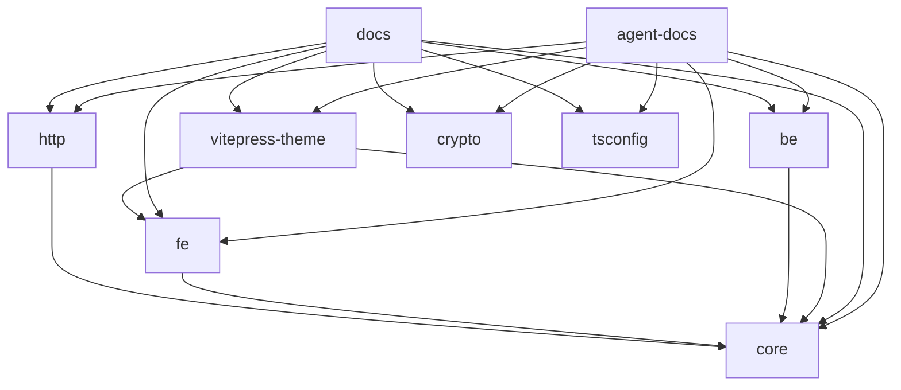

# 代码地图

## 树

```
cat-kit/
├── packages/              # 8 个独立发布的库包，各自 tsdown 构建到 dist
│   ├── core/              # @cat-kit/core — 零外部依赖核心工具（data / data-structure / date / env / optimize / pattern）
│   ├── http/              # @cat-kit/http — 插件架构 HTTP 客户端
│   ├── crypto/            # @cat-kit/crypto — 随机 ID、摘要、加密等安全工具
│   ├── fe/                # @cat-kit/fe — 浏览器工具（storage / virtualizer / web-api / file / tween）
│   ├── be/                # @cat-kit/be — Node 工具（fs / logger / cache / config / net / scheduler / system）
│   ├── cli/               # @cat-kit/cli — 命令行工具（bin: cat-cli）
│   ├── tsconfig/          # @cat-kit/tsconfig — TypeScript 配置预设（纯 JSON，无构建）
│   └── vitepress-theme/   # @cat-kit/vitepress-theme — 水墨丹青 VitePress 主题（Vue）
├── docs/                  # @cat-kit/docs — VitePress 文档站（content/packages/<pkg>/ 按包分章）
├── agent-docs/            # 面向 AI 智能体检索的文档：INDEX.md 根入口 → 包级 index → 主题文件（docs-mcp 推送源）
├── scripts/               # 仓库级工程脚本（Bun 运行）
├── .changeset/            # Changesets 版本与发布记录
├── turbo.json             # Turborepo 任务编排
└── tsconfig.json          # 根 tsconfig（项目引用）
```

## 模块

| 模块 | 路径 | 职责 | 主要入口 |
| --- | --- | --- | --- |
| core | packages/core | 零依赖通用工具：数组/对象/字符串/类型、Tree/Forest、Dater 日期、环境判断、防抖节流等优化、常用模式 | src/index.ts |
| http | packages/http | 插件架构 HTTP 客户端（HttpClient + 插件体系） | src/index.ts |
| crypto | packages/crypto | 随机 ID、摘要、加密等安全工具 | src/index.ts |
| fe | packages/fe | 浏览器工具：存储、虚拟滚动 Virtualizer、Web API 封装、文件处理、tween | src/index.ts |
| be | packages/be | Node 工具：fs、logger、cache、config、net、scheduler、system | src/index.ts |
| cli | packages/cli | 命令行工具（cat-cli：提交信息校验等） | src/cli.ts |
| tsconfig | packages/tsconfig | 按运行环境划分的 TypeScript 配置预设 | tsconfig.json |
| vitepress-theme | packages/vitepress-theme | VitePress 水墨丹青主题：Vue 组件、样式、主题 config | src/index.ts、src/config.ts |
| docs | docs | VitePress 文档站，长文与示例的权威来源 | docs/.vitepress/config.ts |
| agent-docs | agent-docs | 面向 AI 智能体检索的文档：入口 → 包级 index → 主题文件，docs-mcp 推送源 | INDEX.md |
| scripts | scripts | 仓库级工程脚本：release.ts、push-docs.mjs 等 | scripts/release.ts |

## 依赖



## 关键路径

- 构建：`turbo run build` → 各包 tsdown 产 `dist`（vitepress-theme 走自有 `scripts/build.mjs`）
- 发布：`bun run changeset` 录入 → 维护者 `bun run release`（changeset version + commit + push）→ GitHub Actions 发 npm
- AI 文档推送：配 `.env`（SERVER_URL / TOKEN / LIBRARY）后 `bun scripts/push-docs.mjs` 整库推送 `agent-docs/` 到 docs-mcp（slug `cat-kit`，手动）
- 文档站：`docs`（vitepress dev / build），主题来自 `packages/vitepress-theme`
