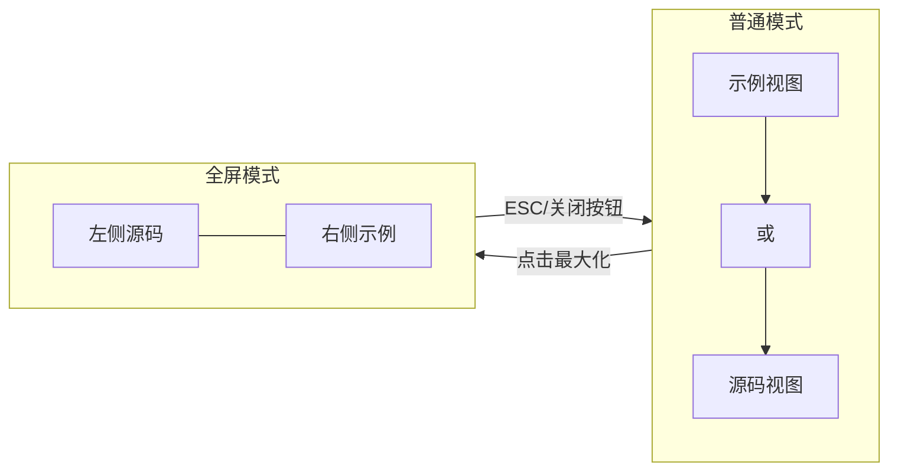

# DemoContainer 交互重构计划

## 目标

重构 [`docs/.vitepress/theme/components/DemoContainer.vue`](docs/.vitepress/theme/components/DemoContainer.vue) 组件，改变交互模式：

1. 源码/示例视图切换（非展开）
2. 全屏模式下左右两栏布局
3. 平滑的过渡动画效果

## 架构变更

### 状态管理

```typescript
// 原状态
const showSource = ref(false)

// 新状态
const viewMode = ref<'preview' | 'code'>('preview')  // 视图切换
const isFullscreen = ref(false)  // 全屏状态
```


### 布局模式对比




## 实现细节

### 1. 模板结构重构

```vue
<template>
  <div class="demo-container" :class="{ fullscreen: isFullscreen }">
    <!-- 全屏时的关闭按钮 -->
    <button v-if="isFullscreen" class="fullscreen-close" @click="exitFullscreen">×</button>
    
    <!-- 主内容区 - 普通模式切换 / 全屏模式两栏 -->
    <div class="demo-content">
      <!-- 源码区域 -->
      <div class="demo-source-panel" v-show="isFullscreen || viewMode === 'code'">
        <!-- 现有源码内容 -->
      </div>
      
      <!-- 预览区域 -->
      <div class="demo-preview-panel" v-show="isFullscreen || viewMode === 'preview'">
        <!-- 现有预览内容 -->
      </div>
    </div>
    
    <!-- 操作栏 -->
    <div class="demo-actions">
      <!-- 切换按钮：根据 viewMode 显示不同图标 -->
      <!-- 新增：最大化按钮 -->
    </div>
  </div>
</template>
```


### 2. 核心逻辑

- `toggleView()`: 切换 viewMode 在 'preview' 和 'code' 之间
- `enterFullscreen()`: 设置 isFullscreen = true，添加 ESC 监听
- `exitFullscreen()`: 设置 isFullscreen = false，移除 ESC 监听
- ESC 键监听：在 `onMounted` 和 `onUnmounted` 中管理

### 3. 样式要点

**全屏模式样式**：

```css
.demo-container.fullscreen {
  position: fixed;
  inset: 0;
  z-index: 1000;
  border-radius: 0;
  display: flex;
  flex-direction: column;
}

.fullscreen .demo-content {
  flex: 1;
  display: flex;
  flex-direction: row;
}

.fullscreen .demo-source-panel,
.fullscreen .demo-preview-panel {
  flex: 1;
  width: 50%;
}
```

**过渡效果**：

```css
.demo-container {
  transition: all 0.3s cubic-bezier(0.4, 0, 0.2, 1);
}
```


### 4. 按钮图标

- **查看源码**（当前为 preview 模式）：代码图标 `</>`
- **查看示例**（当前为 code 模式）：预览图标（眼睛或播放图标）
- **最大化**：全屏展开图标
- **关闭全屏**：X 按钮（仅全屏时显示）

## 保持不变

- 所有 CSS 变量和颜色（`--ink-trace`, `--ink-light`, `--vp-c-bg` 等）
- 复制代码功能
- 行号显示
- 响应式断点样式
- Props 接口

## 文件变更