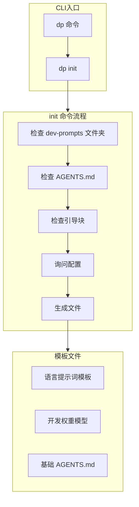

# dev-prompts CLI 工具开发计划

创建 `@cat-kit/prompts` 包，提供 `dp` 命令行工具，帮助开发者快速初始化项目中的 AI 开发提示词。

## 架构设计




## 目录结构

```javascript
packages/prompts/
├── package.json
├── tsconfig.json
├── AGENTS.md
└── src/
    ├── index.ts           # CLI 入口
    ├── commands/
    │   └── init.ts        # init 命令实现
    ├── templates/
    │   ├── agents-block.ts    # AGENTS.md 引导块模板
    │   ├── weight-model.ts    # 开发权重模型模板
    │   └── languages/         # 语言提示词模板
    │       ├── index.ts
    │       ├── typescript.ts
    │       ├── javascript.ts
    │       ├── python.ts
    │       ├── go.ts
    │       ├── java.ts
    │       └── rust.ts
    └── utils/
        ├── fs.ts          # 文件操作工具
        └── questions.ts   # 交互式问询
```


## 核心功能

### 1. `dp init` 命令流程

1. **检测现有配置**

- 检查 `dev-prompts/` 文件夹是否存在
- 检查项目根目录是否有 `AGENTS.md`
- 检查 `AGENTS.md` 是否包含 `dev-prompts` 引导块

2. **交互式配置**

- 多选：开发语言（TypeScript, JavaScript, Python, Go, Java, Rust）
- 单选：是否启用开发权重模型

3. **文件生成**

- 创建 `dev-prompts/` 文件夹
- 根据语言选择生成对应的提示词文件
- 如有需要，生成开发权重模型文件
- 创建/更新 `AGENTS.md` 添加引导块

### 2. 生成的文件示例

**dev-prompts/languages/typescript.md** - TypeScript 代码风格指南**dev-prompts/weight-model.md** - 开发权重模型（正确性 > 安全性 > 性能 > 扩展性 > 前瞻性 等可配置优先级）**AGENTS.md 引导块** - 引导 AI 阅读 `dev-prompts/` 下的提示词文件

## 技术选型

- **CLI 框架**: Commander.js
- **交互式问询**: @inquirer/prompts（轻量级，支持多选/单选）
- **文件操作**: Node.js fs/promises

## 关键文件