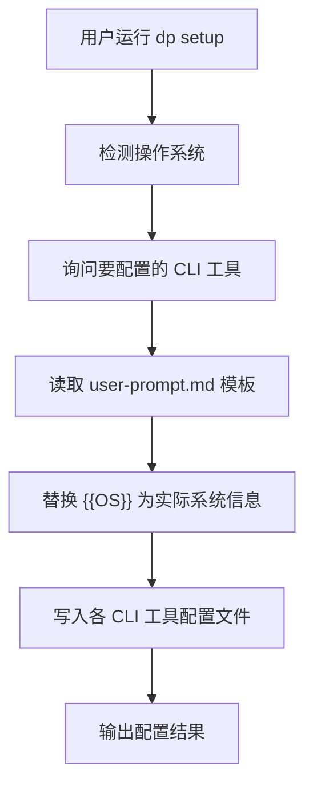

# @cat-kit/prompts 包重构计划

## 概述

对 `packages/prompts` 包进行重构：移除权重模型功能，新增 `setup` 命令以支持多 AI CLI 工具的用户级提示词配置。

## 当前代码结构

```javascript
packages/prompts/
├── src/
│   ├── index.ts              # CLI 入口
│   ├── commands/
│   │   └── init.ts           # init 命令实现
│   └── utils/
│       ├── fs.ts             # 文件路径工具
│       ├── questions.ts      # 交互式问答
│       └── templates.ts      # 模板处理
└── templates/
    ├── agents-block.md       # AGENTS.md 引导块模板
    ├── user-prompt.md        # 用户提示词模板
    └── languages/            # 语言规范模板
```


## 变更内容

### 1. 移除权重模型

需要清理的代码：

- [`src/commands/init.ts`](packages/prompts/src/commands/init.ts)：移除 `copyWeightModelFile` 函数及相关调用
- [`src/utils/questions.ts`](packages/prompts/src/utils/questions.ts)：移除 `useWeightModel` 询问和类型定义
- [`src/utils/templates.ts`](packages/prompts/src/utils/templates.ts)：移除 `generateWeightModelSection` 函数和相关参数
- [`templates/agents-block.md`](packages/prompts/templates/agents-block.md)：移除 `{{WEIGHT_MODEL_SECTION}}` 占位符

### 2. 新增 setup 命令

创建新命令用于设置用户级提示词，支持以下 AI CLI 工具：| CLI 工具 | 配置文件路径 |

|---------|-------------|

| Claude Code | `~/.claude/CLAUDE.md` |

| Codex CLI | `~/.codex/AGENTS.md` |

| Gemini CLI | `~/.gemini/GEMINI.md` |

#### 新增文件

- `src/commands/setup.ts`：setup 命令实现
- `src/utils/os.ts`：操作系统检测和路径处理工具

#### 命令流程




#### 操作系统信息格式

`{{OS}}` 将被替换为人类可读的操作系统描述，例如：

- Windows: `Windows 10/11`
- macOS: `macOS (Darwin)`
- Linux: `Linux`

### 3. 更新入口文件

在 [`src/index.ts`](packages/prompts/src/index.ts) 中注册新的 `setup` 命令。

## 实现细节

### setup 命令交互流程

1. 检测并显示当前操作系统
2. 询问用户要配置哪些 CLI 工具（多选）
3. 检查目标目录是否存在，不存在则创建
4. 读取模板并替换 `{{OS}}`
5. 写入配置文件（如已存在则询问是否覆盖）
6. 输出配置结果

### 跨平台路径处理

使用 `os.homedir()` 获取用户主目录，确保跨平台兼容：

- Windows: `C:\Users\username`