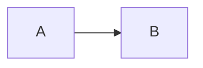

# @cat-kit/vitepress-theme/config 站点配置助手

`@cat-kit/vitepress-theme/config` 子路径导出 4 个站点配置入口：`defineThemeConfig` 一次生成完整的 `markdown` 与 `vite` 配置片段（内部组合其余 3 个入口），`demoContainer` 注册 `::: demo` 容器，`mermaidPlugin` 把 mermaid 围栏代码块替换为 `Mermaid` 组件，`importExamples` 为页面里的 `::: demo` 自动生成组件 import。这 4 个函数只从本子路径导出，包根不导出。

## 安装

```bash
bun add -D @cat-kit/vitepress-theme mermaid
# peers 需已安装：vitepress ^2.0.0-alpha.20、vue ^3.5.42
# mermaid 供 Mermaid 图表渲染使用，站点必须自行安装
```

最小接入（完整文件，`defineThemeConfig` 返回值展开合并进 VitePress 配置）：

```ts
// .vitepress/config.mts
import { defineConfig } from 'vitepress'
import { fileURLToPath } from 'node:url'
import { defineThemeConfig } from '@cat-kit/vitepress-theme/config'

// examples 目录的绝对路径
const examplesDir = fileURLToPath(new URL('../examples', import.meta.url))

export default defineConfig({
  title: 'My Docs',
  ...defineThemeConfig({ examplesDir })
})
```

`defineThemeConfig` 生成的内容：`markdown.lineNumbers: true`、`markdown.config`（注册 `demoContainer` 与 `mermaidPlugin`）、`vite.plugins`（注册 `importExamples`）。使用它之后无需再手动调用其余 3 个入口；需要自定义 `markdown.config` 或 `vite.plugins` 时，改为逐个接入，见 `packages/vitepress-theme/config/apis.md` 的典型示例。

配置生效后的 Markdown 侧写法与页面产物：

````md
::: demo basic-counter.vue
:::


````

`::: demo` 渲染为可交互的 `DemoContainer`（预览、源码高亮、复制、控制台、全屏），mermaid 围栏渲染为图表。宿主在 vite `resolve.conditions` 中加入 `development` 时，本包导入直接解析到 `src/config.ts` 源码。

## 模块速查

| 导出名 | 说明 | 文档路径 |
| --- | --- | --- |
| `defineThemeConfig` | 组合其余 3 个入口，返回可展开合并的 `Partial<UserConfig>` | `packages/vitepress-theme/config/apis.md` |
| `demoContainer` | markdown-it 容器插件，把 `::: demo <路径>` 渲染为 `DemoContainer` 组件，异步（首次调用初始化 Shiki） | `packages/vitepress-theme/config/apis.md` |
| `mermaidPlugin` | 覆盖 fence 渲染，把 info 为 `mermaid` 的围栏代码块替换为 `<Mermaid>` 组件 | `packages/vitepress-theme/config/apis.md` |
| `importExamples` | Vite 插件（name `md-transform`，`enforce: 'pre'`），为页面中的 `::: demo` 生成 `<script setup>` import | `packages/vitepress-theme/config/apis.md` |
| `CatKitThemeOptions` | `defineThemeConfig` 的参数类型：`{ examplesDir: string }` | `packages/vitepress-theme/config/apis.md` |
| `DemoContainerOptions` | `demoContainer` 的参数类型：`{ examplesDir: string }` | `packages/vitepress-theme/config/apis.md` |
| `ImportExamplesOptions` | `importExamples` 的参数类型：`{ examplesDir: string }` | `packages/vitepress-theme/config/apis.md` |

### 接入方式二选一

- 全部功能都要、不改动 VitePress 默认 markdown / vite 配置：用 `defineThemeConfig`，一行展开合并
- 需要自定义 `markdown.config`（再加其他 markdown-it 插件）或 `vite.plugins`（再加其他 vite 插件）：不用 `defineThemeConfig`，改为单独调用 `demoContainer`、`mermaidPlugin`、`importExamples`，与自有插件共存

函数签名、参数约束、典型示例与报错处理见 `packages/vitepress-theme/config/apis.md`。
