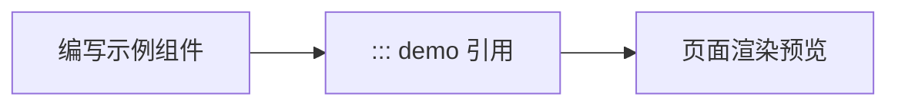

# @cat-kit/vitepress-theme 文档站 Demo 容器接入

`@cat-kit/vitepress-theme` 文档站接入方案：默认导出提供水墨主题与 `DemoContainer`、`Mermaid` 全局组件，`defineThemeConfig` 注入 demo 容器、Mermaid 围栏替换与示例组件导入插件，之后 Markdown 里即可用 `::: demo` 引用 Vue 示例组件、用 mermaid 围栏渲染图表。

## 场景

- 何时用本方案：文档站需要展示可交互 Vue 示例（预览、源码查看、复制、控制台、全屏），并在页面中渲染 Mermaid 图表
- 何时不用：只需要水墨主题样式、不需要 demo 容器时，只接默认主题（见 `packages/vitepress-theme/theme/index.md`）；需要手动拆配单个插件时，按 `packages/vitepress-theme/config/apis.md` 逐个接入

## 完整示例

安装依赖：

```bash
bun add -D @cat-kit/vitepress-theme mermaid
# peers 需已安装：vitepress ^2.0.0-alpha.20、vue ^3.5.42
```

```ts
// .vitepress/theme/index.ts
import theme from '@cat-kit/vitepress-theme'

// 默认导出已注册全局组件 DemoContainer 与 Mermaid，并自动加载主题样式
export default theme
```

```ts
// .vitepress/config.mts
import { defineConfig } from 'vitepress'
import { fileURLToPath } from 'node:url'
import { defineThemeConfig } from '@cat-kit/vitepress-theme/config'

// examples 目录的绝对路径：站点根目录下的 examples/
const examplesDir = fileURLToPath(new URL('../examples', import.meta.url))

export default defineConfig({
  title: 'My Docs',
  // defineThemeConfig 返回 markdown 与 vite 配置片段，必须展开合并
  ...defineThemeConfig({ examplesDir })
})
```

```vue
<!-- examples/basic-counter.vue -->
<script setup lang="ts">
import { ref } from 'vue'

const count = ref(0)

function increase() {
  count.value += 1
  // 输出会进入 DemoContainer 底部的控制台面板
  console.log('count =', count.value)
}
</script>

<template>
  <button @click="increase">点击 +1，当前 {{ count }}</button>
</template>
```

````md
<!-- guide/demo.md，站点根目录下 -->
---
title: 示例
---

## 计数器

::: demo basic-counter.vue
:::

## 流程图


````

运行 `vitepress dev` 后，`demo.md` 页面渲染出：计数器示例的预览与源码视图（`basic-counter.vue` 源码由 Shiki 按 `vue` 语言高亮）、示例内 `console.log` 的控制台面板，以及一张 Mermaid 流程图。

## 要点说明

- `examplesDir` 必须是绝对路径：`demoContainer` 用 `path.join(examplesDir, demoPath)` 定位示例文件，`importExamples` 用 `path.relative` 计算生成 import 的相对路径
- `::: demo` 中 `:::` 与 `demo` 之间必须写空格，且容器必须有配对的收尾 `:::`：`importExamples` 的匹配正则为 `/^:::\s+demo\s*(.*)$/m`，`:::demo` 这种无空格写法不会生成 import；容器未收尾时 markdown-it-container 不输出 `<DemoContainer>` 标签
- `::: demo` 后的路径相对 `examplesDir` 解析，必须指向具体文件（如 `basic-counter.vue`）；示例组件名由文件名自动推导，`basic-counter.vue` 生成 `import BasicCounter from ...`，页面中无需手写 import
- `mermaid` 围栏的渲染依赖 `Mermaid` 全局组件与站点安装的 `mermaid` 包；`Mermaid` 组件动态 `import('mermaid')`，未安装时图表区域显示错误信息并在控制台输出 `Mermaid render error`

## 注意事项

> [!WARNING]
> - 本库的示例引用语法是 `::: demo <相对路径>`，不是 `<demo>` 标签或 `::: vue-demo`。
> - `defineThemeConfig` 返回值包含 `markdown.config` 与 `vite.plugins`；在 `defineConfig` 中必须用展开合并，禁止再定义同名字段整体覆盖，否则 demo 容器与导入插件失效。
> - 示例源码高亮语言固定为 `vue`（Shiki 双主题 `github-light` / `github-dark`），`.ts` 示例文件按 Vue 语法高亮。
> - `::: demo` 指向的文件不存在时不报错，页面渲染无源码的占位容器；排查路径拼写与 `examplesDir` 取值。
