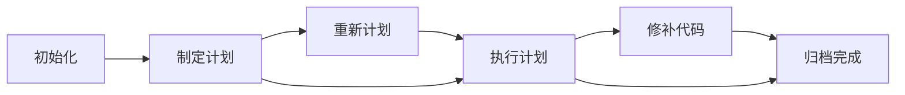

# 代理上下文

如果在和 AI 结对编程的过程中，你曾遇到过这些痛点：

- 随着对话变长，AI 渐渐忘记了最初的整体计划。
- 难以管理复杂的多步长线任务，做到一半思路全乱。
- 在不同 AI 工具 (Cursor、Claude、Antigravity 等) 之间切换时，任务状态无法续接。

`@cat-kit/agent-context` 正是为你准备的。

## 什么是 Agent Context？

它是一个**面向 AI 编程助手的命令行辅助工具**。只需一行命令，它就能为当前主流的 AI 助手安装统一的 `agent-context` 技能 (Skill/规则设定)。

安装该技能后，你的 AI 助手将学会一套**严格的计划生命周期管理协议**。你们将拥有一个共同的心智模型：
所有的复杂任务都会具象化为 `.agent-context/` 目录下的 Markdown 计划文件。AI 将依据一套状态机严格推进任务，确保项目不跑偏。

### 核心理念：计划生命周期

核心生命周期状态机如下：



由于 AI 已经深度理解了这套协议，你只需**像指派真人同事一样，使用自然语言**指挥 AI 推进状态即可。

---

## 快速开始

### 1. 安装 CLI 工具

推荐进行全局安装：

```bash
npm install -g @cat-kit/agent-context
```

### 2. 在项目中安装 AI 技能

在你的项目根目录下执行：

```bash
agent-context install
```

CLI 会让你交互式选择你正在使用的 AI 工具。选中后，CLI 会在项目目录下生成对应的技能协议文件（例如 `.cursor/skills/agent-context/SKILL.md`）。

> **💡 最佳实践**: 建议将生成的 `.agent-context/` 目录以及技能配置文件一同提交到 Git 仓库中。这样你的团队协作成员——甚至是切换不同的 AI 工具时——都能共享同一个任务上下文进度！

---

## 如何与 AI 协作？

技能安装完成后，AI 已经"开窍"了。你可以在对话框中直接用自然语言指挥它：

**👉 启动新任务：**

> _"初始化项目的 agent context，我们要开发一个登录页面，请先出一个清晰的计划。"_

**👉 按部就班推进：**

> _"计划不错，按当前计划的步骤 1 开始实现代码。"_

**👉 遇到需求变更或思路不对：**

> _"第二步的做法要改一下，不用这个库了，帮我 replan（重做）当前计划。"_

**👉 修补小 Bug：**

> _"刚刚写的代码有点小 bug，给当前计划补一个 patch 修一下。"_

**👉 漂亮收尾：**

> _"当前计划已经真正完成，在被我 push 之前，请归档它 (done)。"_

---

## 命令行参考

在日常开发中，大多数情况下你可以直接靠嘴（自然语言）让 AI 帮你管理这些状态。但在必要时，你也可以使用命令手动检查和管理。

### `agent-context status`

查看当前状态（当前正处于什么计划阶段、激活的计划编号等）。

```bash
agent-context status
```

### `agent-context validate`

校验 `.agent-context` 目录下的结构和计划文件是否符合协议规范。如果你不确定 AI 有没有"瞎写"，可以通过此命令检查。

```bash
agent-context validate
```

### `agent-context done`

手动归档当前已执行完毕的计划，状态流转为 done。

```bash
agent-context done
agent-context done --yes # 自动确认
```

### `agent-context sync` & `agent-context install`

管理技能文件更新。

```bash
# 升级全局的 `@cat-kit/agent-context` 后，在此项目运行以同步最新协议
agent-context sync

# 查看所有支持的指定参数安装选项
agent-context install --help
agent-context install --tools claude,cursor --yes
```

---

## 支持的 AI 工具

目前原生支持为以下工具自动生成技能协议：

| 工具名称           | 生成技能目录路径                |
| ------------------ | ------------------------------- |
| **Cursor**         | `.cursor/skills/agent-context/` |
| **Claude**         | `.claude/skills/agent-context/` |
| **GitHub Copilot** | `.github/skills/agent-context/` |
| **Antigravity**    | `.agent/skills/agent-context/`  |
| **Codex**          | `.codex/skills/agent-context/`  |

_(注：工具会根据不同的 AI 平台支持的格式精确输出配置，包含必备的 frontmatter 和描述文件。)_
