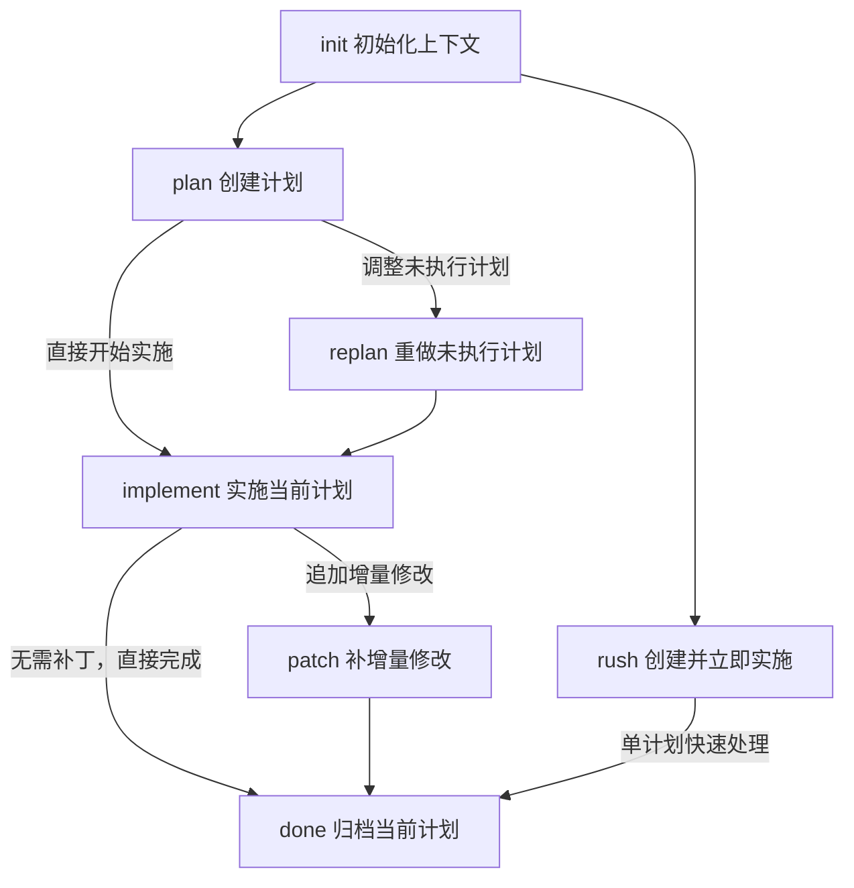

# Agent Context

`@cat-kit/agent-context` 用来把 `ac-workflow` 安装到不同 AI 工具中，让它们围绕同一份 `.agent-context/` 计划目录协作。

它适合需要多轮执行、阶段切换和归档留痕的任务。CLI 负责安装与校验，Skill 负责识别 `init / plan / replan / implement / patch / rush / done` 这些动作。

## 生命周期

## 页面导航

- [Action 说明](./actions)
- [AI 协作场景](./collaboration)
- [CLI 命令](./cli)
