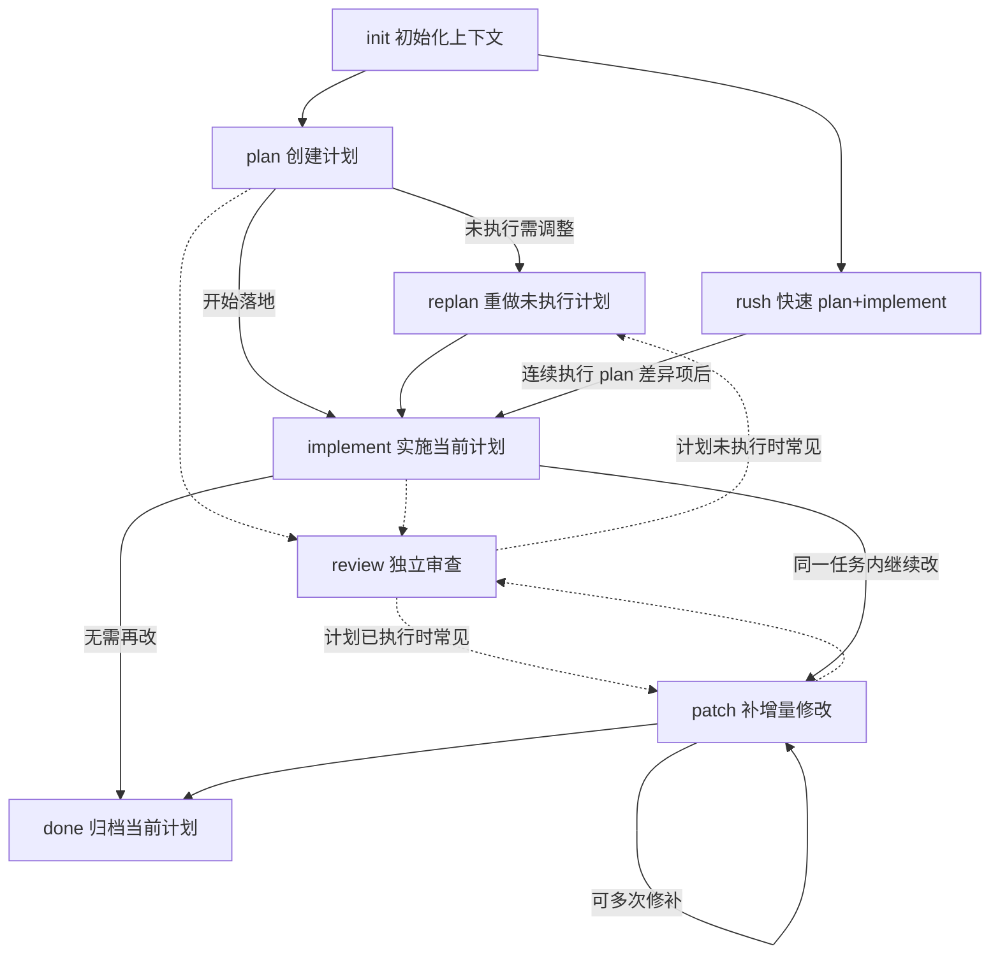
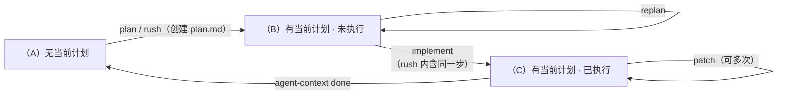

# Agent Context

`@cat-kit/agent-context` 用来把 `ac-workflow` 安装到不同 AI 工具中，让它们围绕同一份 `.agent-context/` 计划目录协作。适用环境：Node.js。

它由两部分组成：

- **CLI**：安装 Skill、同步协议、校验目录结构、管理计划生命周期（归档、索引）、升级自身
- **Skill**：用 frontmatter `description` 触发 `init、plan、replan、implement、patch、rush、review、done` 协议意图；`SKILL.md` 只保留启动检查与路由，完整协议按需读取 `references/*.md`

安装模型采用“canonical open standard + 可选兼容入口”：默认只渲染 `.agents/skills/ac-workflow/`，作为唯一 canonical source；`--tools claude,codex,...` 只创建兼容入口，优先 symlink / junction 指向 canonical source，不支持 symlink 或已有普通目录时退回复制同步。

目录结构：

```text
.agent-context/
├── .env               # SCOPE 配置（SCOPE=<name>）
├── .gitignore
└── {scope}/           # 作用域目录（按协作者隔离）
    ├── index.md       # 计划索引（自动生成）
    ├── plan-{N}/      # 当前计划（最多一个）
    │   ├── plan.md
    │   └── patch-{N}.md
    ├── preparing/     # 待执行计划队列
    │   └── plan-{N}/
    └── done/          # 已归档计划
        └── plan-{N}-{YYYYMMDD}/
```

### Skill 渐进式披露

安装后的 `ac-workflow` 对齐 Agent Skills 的渐进式披露模型：

- `SKILL.md`：短导航入口，负责运行上下文脚本、执行 `agent-context validate`、根据 `currentPlanStatus` 选择协议
- `references/*.md`：完整协议正文，只有确定动作后才读取对应文件；`rush` 这类组合协议会在需要时再读取被引用协议
- `references/ask-user-question.md`：交互式提问规范，不写死具体工具名；host/runtime 可提供 `AskUserQuestion`、`request_user_input`、`question` 等不同名称
- `scripts/get-context-info.js`：输出 `scope`、当前计划、下一个计划编号和下一个补丁编号，Skill 不应自行扫描目录推断这些值
- `scripts/validate-context.js`：当全局 CLI 与 `npx @cat-kit/agent-context validate` 都不可用时，提供 bundled validate fallback
- `description`：只面向 `ac-workflow` / `.agent-context` 意图触发；普通 coding、code review、planning、`AGENTS.md` 文档修改不应触发

### 动作依赖图（主路径与 review）

与 `packages/agent-context/src/skill/protocols/*.ts` 一致：`rush` 在单条流程里先按 `plan` 的差异规则写好 `plan.md`，再**完整**执行 `implement`（无裁剪），因此落地后与普通 `plan → implement` 相同，可继续 `patch`、`review`、`done`，而不是跳过实施直接归档。



说明：`plan` / `implement` / `rush` 在协议末尾均可按 Skill 约定询问用户是否立刻 `review`。`review` 不接受额外描述；审查后常见后续为 `replan`（仍 `未执行`）或 `patch`（已 `已执行`）。

### 状态机与路由

校验与状态由 CLI `validate` / `status` 与 `plan.md` 状态行驱动；两态为 **`未执行`**、**`已执行`**。下图表示「目录里有没有当前计划、计划处于哪一态」之间的转移；`review` 不改变状态行，故不单独画状态迁移。



各状态下 Skill 路由（安装后的 `SKILL.md` 只保留这类紧凑导航，协议细节在 `references/` 中）：

| 状态 | 可选动作                                                      |
| ---- | ------------------------------------------------------------- |
| A    | `init`、`plan`、`rush`                                        |
| B    | `implement`、`replan`、`review`；无关新需求 → 询问归档或终止  |
| C    | `patch`、`review`、`done`（CLI）；无关新需求 → 询问归档或终止 |

## 页面导航

- [Protocol 说明](./protocols) — 每个协议的适用时机、前置条件和产物
- [AI 协作场景](./collaboration) — 按任务类型选择正确动作的具体流程
- [CLI 命令](./cli) — 安装、同步、校验、状态、归档、索引

## 常见问题

### 交互式提问工具不可用

Skill 协议只要求“优先使用当前运行环境提供的交互式提问工具”，不会假设固定工具名。不同 host 可能叫 `AskUserQuestion`、`request_user_input`、`question` 或其他名称；如果当前环境没有交互式提问工具，应直接用简短文本问题询问用户并暂停。

Codex 中如需启用 `request_user_input`，可在配置中（用户目录：`~/.codex/config.toml` 或项目根目录：`.codex/config.toml`）启用以下功能标识：

```toml
[features]
default_mode_request_user_input = true
```
