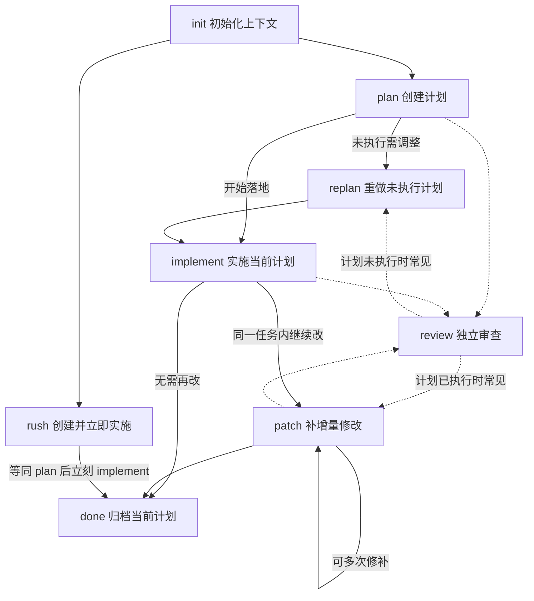

# Agent Context

`@cat-kit/agent-context` 用来把 `ac-workflow` 安装到不同 AI 工具中，让它们围绕同一份 `.agent-context/` 计划目录协作。适用环境：Node.js。

它由两部分组成：

- **CLI**：安装 Skill、同步协议、校验目录结构、管理计划生命周期（归档、索引）
- **Skill**：在对话中识别 `init / plan / replan / implement / patch / rush / review / done` 动作意图，按协议推进任务

目录结构：

```text
.agent-context/
├── .env               # SCOPE 配置（SCOPE=<name>）
├── .gitignore
└── {scope}/           # 作用域目录（按协作者隔离）
    ├── index.md       # 计划索引（自动生成）
    ├── plan-{N}/      # 当前计划（最多一个）
    │   ├── plan.md
    │   └── patch-{N}.md
    ├── preparing/     # 待执行计划队列
    │   └── plan-{N}/
    └── done/          # 已归档计划
        └── plan-{N}-{YYYYMMDD}/
```

生命周期（实线为主路径；虚线为按需触发的 **`review`**，典型后续取决于计划是否已执行）：



说明：`review` 不接受额外描述，协议要求用独立子代理做第三方视角审查；审查后通常建议走 `replan`（计划仍 `未执行`）或 `patch`（计划已 `已执行`），也可在确认无问题后继续原路径。

## 页面导航

- [Action 说明](./actions) — 每个动作的适用时机、前置条件和产物
- [AI 协作场景](./collaboration) — 按任务类型选择正确动作的具体流程
- [CLI 命令](./cli) — 安装、同步、校验、状态、归档、索引
