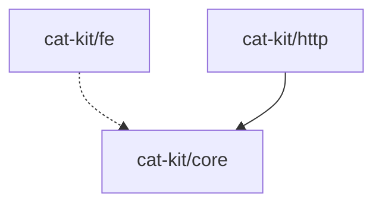

# 依赖管理

依赖管理模块提供循环依赖检测、版本一致性检查和依赖图可视化功能。

## checkCircularDependencies

使用 Tarjan 算法检测包之间的循环依赖。时间复杂度 O(V + E)。

```typescript
function checkCircularDependencies(packages: PackageInfo[]): CircularDependencyResult
```

**参数：**

| 参数 | 类型 | 说明 |
| --- | --- | --- |
| `packages` | `PackageInfo[]` | 包信息列表 |

**返回值：**

```typescript
interface CircularDependencyResult {
  hasCircular: boolean
  cycles: CircularChain[]
}

interface CircularChain {
  chain: string[]      // 依赖链
  startIndex: number   // 循环起点索引
}
```

**示例：**

```typescript
import { checkCircularDependencies } from '@cat-kit/maintenance'

const packages = [
  { name: '@my/core', pkg: { name: '@my/core', version: '1.0.0' } },
  { name: '@my/utils', pkg: { name: '@my/utils', version: '1.0.0', dependencies: { '@my/core': '^1.0.0' } } }
]

const result = checkCircularDependencies(packages)

if (result.hasCircular) {
  result.cycles.forEach(cycle => {
    console.log(cycle.chain.join(' → '))
  })
}
```

## checkVersionConsistency

检测包之间相同外部依赖是否使用了不同版本号。

```typescript
function checkVersionConsistency(packages: PackageInfo[]): ConsistencyResult
```

**返回值：**

```typescript
interface ConsistencyResult {
  consistent: boolean
  inconsistent: InconsistentDependency[]
}

interface InconsistentDependency {
  name: string
  versions: Array<{
    version: string
    usedBy: string[]
  }>
}
```

**示例：**

```typescript
import { checkVersionConsistency } from '@cat-kit/maintenance'

const result = checkVersionConsistency(packages)

if (!result.consistent) {
  result.inconsistent.forEach(dep => {
    console.log(`${dep.name}:`)
    dep.versions.forEach(v => {
      console.log(`  ${v.version} @ ${v.usedBy.join(', ')}`)
    })
  })
}
```

::: tip 注意
- 检查 `dependencies` 和 `devDependencies`
- `peerDependencies` 不参与检查
- `workspace:*` 依赖会被跳过
:::

## buildDependencyGraph

构建包含所有依赖的完整依赖关系图。

```typescript
function buildDependencyGraph(
  packages: (PackageInfo & { version: string })[]
): DependencyGraph
```

**返回值：**

```typescript
interface DependencyGraph {
  nodes: DependencyNode[]
  edges: DependencyEdge[]
}

interface DependencyNode {
  id: string
  version: string
  external: boolean
}

interface DependencyEdge {
  from: string
  to: string
  type: 'dependencies' | 'devDependencies' | 'peerDependencies'
}
```

**示例：**

```typescript
import { buildDependencyGraph } from '@cat-kit/maintenance'

const graph = buildDependencyGraph(packages)

const internal = graph.nodes.filter(n => !n.external)
const external = graph.nodes.filter(n => n.external)

console.log(`内部包: ${internal.length}`)
console.log(`外部依赖: ${external.length}`)
```

## visualizeDependencyGraph

将依赖关系图转换为 Mermaid 格式。

```typescript
function visualizeDependencyGraph(
  graph: DependencyGraph,
  options?: {
    includeExternal?: boolean   // 包含外部依赖，默认 false
    distinguishTypes?: boolean  // 区分依赖类型，默认 true
  }
): string
```

**箭头类型：**

| 依赖类型 | 箭头 |
| --- | --- |
| dependencies | `-->` |
| devDependencies | `--->` |
| peerDependencies | `-.->` |

**示例：**

```typescript
import { buildDependencyGraph, visualizeDependencyGraph } from '@cat-kit/maintenance'

const graph = buildDependencyGraph(packages)
const mermaid = visualizeDependencyGraph(graph, {
  includeExternal: false,
  distinguishTypes: true
})

console.log(mermaid)
```

**输出：**



## 使用 Monorepo 类

推荐使用 `Monorepo` 类进行依赖分析：

```typescript
import { Monorepo } from '@cat-kit/maintenance'

const repo = new Monorepo()

// 验证（包含循环依赖和版本一致性检查）
const validation = repo.validate()

if (!validation.valid) {
  console.log('循环依赖:', validation.circularChains)
  console.log('版本不一致:', validation.inconsistentDeps)
}

// 构建依赖图
const graph = repo.buildDependencyGraph({ includeExternal: false })
console.log(graph.mermaid)
```

## 类型定义

```typescript
interface PackageInfo {
  name: string
  version?: string
  pkg: PackageJson
}
```

## 实际应用

### CI 检查脚本

```typescript
import { Monorepo } from '@cat-kit/maintenance'

const repo = new Monorepo()
const validation = repo.validate()

if (validation.hasCircular) {
  console.error('❌ 发现循环依赖')
  process.exit(1)
}

if (validation.inconsistentDeps.length > 0) {
  console.error('❌ 发现版本不一致')
  process.exit(1)
}

console.log('✅ 依赖检查通过')
```

### 生成依赖文档

```typescript
import { writeFileSync } from 'node:fs'
import { Monorepo } from '@cat-kit/maintenance'

const repo = new Monorepo()
const graph = repo.buildDependencyGraph({ includeExternal: false })

const markdown = `# 包依赖关系

\`\`\`mermaid
${graph.mermaid}
\`\`\`
`

writeFileSync('docs/DEPENDENCIES.md', markdown)
```
