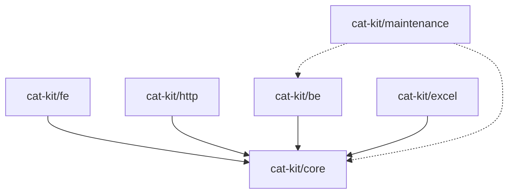
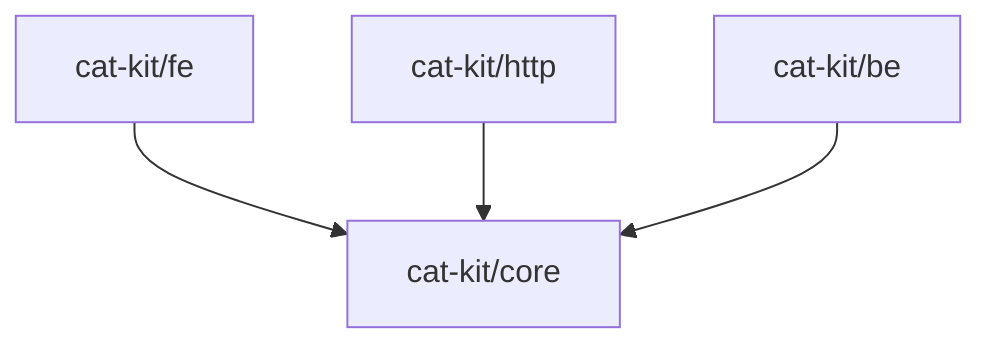

# 依赖管理 (deps)

依赖管理模块提供了一系列工具，用于分析和管理 monorepo 中的依赖关系。支持循环依赖检测、版本一致性检查和依赖图可视化等功能。

## 循环依赖检测

### checkCircularDependencies

使用 Tarjan 算法检测 monorepo 中的循环依赖。时间复杂度为 O(V + E)，其中 V 是包数量，E 是依赖关系数量。

**函数签名：**

```typescript
function checkCircularDependencies(
  config: MonorepoConfig
): Promise<CircularDependencyResult>
```

**参数：**

| 参数 | 类型 | 说明 |
| --- | --- | --- |
| `config` | `MonorepoConfig` | Monorepo 配置 |

**返回值：**

```typescript
interface CircularDependencyResult {
  /** 是否存在循环依赖 */
  hasCircular: boolean
  /** 循环依赖链列表 */
  cycles: CircularChain[]
}

interface CircularChain {
  /** 依赖链（包名数组） */
  chain: string[]
  /** 循环起点索引 */
  startIndex: number
}
```

**示例：**

```typescript
import { checkCircularDependencies } from '@cat-kit/maintenance'

const result = await checkCircularDependencies({
  rootDir: '/path/to/monorepo'
})

if (result.hasCircular) {
  console.log('发现循环依赖:')
  result.cycles.forEach(cycle => {
    // 输出如: @my-org/a → @my-org/b → @my-org/a
    console.log(cycle.chain.join(' → '))
  })
} else {
  console.log('✓ 未发现循环依赖')
}
```

**算法说明：**

该函数使用 Tarjan 算法查找强连通分量（Strongly Connected Components, SCC）。如果一个 SCC 包含多于一个节点，说明存在循环依赖。

```
包 A ──依赖──→ 包 B
  ↑              │
  └──── 依赖 ←───┘

上图中 A 和 B 形成循环依赖
```

## 版本一致性检查

### checkVersionConsistency

检测 monorepo 中相同的外部依赖是否使用了不同的版本号。这有助于发现潜在的版本冲突问题。

**函数签名：**

```typescript
function checkVersionConsistency(
  config: MonorepoConfig,
  options?: {
    /** 忽略的依赖包（不检查版本一致性） */
    ignore?: string[]
  }
): Promise<ConsistencyResult>
```

**参数：**

| 参数 | 类型 | 说明 |
| --- | --- | --- |
| `config` | `MonorepoConfig` | Monorepo 配置 |
| `options.ignore` | `string[]` | 可选，忽略检查的依赖列表 |

**返回值：**

```typescript
interface ConsistencyResult {
  /** 是否一致 */
  consistent: boolean
  /** 不一致的依赖列表 */
  inconsistent: InconsistentDependency[]
}

interface InconsistentDependency {
  /** 依赖名称 */
  name: string
  /** 不同的版本列表 */
  versions: Array<{
    /** 版本号 */
    version: string
    /** 使用该版本的包 */
    usedBy: string[]
  }>
}
```

**示例：**

```typescript
import { checkVersionConsistency } from '@cat-kit/maintenance'

const result = await checkVersionConsistency(
  { rootDir: '/path/to/monorepo' },
  { ignore: ['typescript'] } // 忽略 TypeScript 版本检查
)

if (!result.consistent) {
  console.log('发现版本不一致:')
  result.inconsistent.forEach(dep => {
    console.log(`\n📦 ${dep.name}:`)
    dep.versions.forEach(v => {
      console.log(`  ${v.version}`)
      v.usedBy.forEach(pkg => console.log(`    └─ ${pkg}`))
    })
  })
}
```

**输出示例：**

```
发现版本不一致:

📦 lodash:
  ^4.17.21
    └─ @my-org/core
    └─ @my-org/utils
  ^4.17.15
    └─ @my-org/legacy

📦 axios:
  ^1.6.0
    └─ @my-org/http
  ^0.27.0
    └─ @my-org/old-client
```

::: tip 注意
- 此函数检查 `dependencies` 和 `devDependencies`
- `peerDependencies` 不参与检查（因为通常使用版本范围）
- `workspace:*` 类型的依赖会被跳过
:::

## 依赖图构建

### buildDependencyGraph

构建包含所有内部和外部依赖的完整依赖关系图。

**函数签名：**

```typescript
function buildDependencyGraph(
  config: MonorepoConfig
): Promise<DependencyGraph>
```

**返回值：**

```typescript
interface DependencyGraph {
  /** 节点（包） */
  nodes: DependencyNode[]
  /** 边（依赖关系） */
  edges: DependencyEdge[]
}

interface DependencyNode {
  /** 节点 ID（包名称） */
  id: string
  /** 包版本 */
  version: string
  /** 是否为外部依赖 */
  external: boolean
}

interface DependencyEdge {
  /** 起始节点（依赖方） */
  from: string
  /** 目标节点（被依赖方） */
  to: string
  /** 依赖类型 */
  type: 'dependencies' | 'devDependencies' | 'peerDependencies'
}
```

**示例：**

```typescript
import { buildDependencyGraph } from '@cat-kit/maintenance'

const graph = await buildDependencyGraph({
  rootDir: '/path/to/monorepo'
})

console.log(`共 ${graph.nodes.length} 个节点`)
console.log(`共 ${graph.edges.length} 条依赖关系`)

// 统计内部包和外部包
const internalPkgs = graph.nodes.filter(n => !n.external)
const externalPkgs = graph.nodes.filter(n => n.external)

console.log(`内部包: ${internalPkgs.length}`)
console.log(`外部依赖: ${externalPkgs.length}`)

// 查找特定包的依赖
const coreDeps = graph.edges.filter(e => e.from === '@my-org/core')
console.log('\n@my-org/core 的依赖:')
coreDeps.forEach(e => console.log(`  → ${e.to} (${e.type})`))
```

## 依赖图可视化

### visualizeDependencyGraph

将依赖关系图转换为 Mermaid 格式，方便在文档或 README 中展示。

**函数签名：**

```typescript
function visualizeDependencyGraph(
  graph: DependencyGraph,
  options?: {
    /** 是否包含外部依赖（默认 false） */
    includeExternal?: boolean
    /** 是否区分依赖类型（默认 true） */
    distinguishTypes?: boolean
  }
): string
```

**参数：**

| 参数 | 类型 | 默认值 | 说明 |
| --- | --- | --- | --- |
| `graph` | `DependencyGraph` | - | 依赖关系图 |
| `options.includeExternal` | `boolean` | `false` | 是否包含外部依赖 |
| `options.distinguishTypes` | `boolean` | `true` | 是否用不同箭头区分依赖类型 |

**箭头类型说明：**

| 依赖类型 | 箭头样式 | 说明 |
| --- | --- | --- |
| `dependencies` | `-->` | 实线箭头 |
| `devDependencies` | `--->` | 粗箭头 |
| `peerDependencies` | `-.->` | 虚线箭头 |

**示例：**

```typescript
import {
  buildDependencyGraph,
  visualizeDependencyGraph
} from '@cat-kit/maintenance'

const graph = await buildDependencyGraph({
  rootDir: '/path/to/monorepo'
})

// 只显示内部包依赖
const mermaid = visualizeDependencyGraph(graph, {
  includeExternal: false,
  distinguishTypes: true
})

console.log(mermaid)
```

**输出示例：**



**在 Markdown 中使用：**

````markdown
# 项目依赖关系


````

## 类型定义

### MonorepoConfig

```typescript
interface MonorepoConfig {
  /** 项目根目录（绝对路径） */
  rootDir: string
  /** 包目录模式（默认从 package.json 的 workspaces 字段读取） */
  workspaces?: string[]
}
```

### 完整类型导出

```typescript
// 从 @cat-kit/maintenance 导入类型
import type {
  // 依赖图相关
  DependencyGraph,
  DependencyNode,
  DependencyEdge,
  // 循环依赖检测
  CircularDependencyResult,
  CircularChain,
  // 版本一致性
  ConsistencyResult,
  InconsistentDependency
} from '@cat-kit/maintenance'
```

## 实际应用

### CI 检查脚本

```typescript
// scripts/check-deps.ts
import {
  checkCircularDependencies,
  checkVersionConsistency
} from '@cat-kit/maintenance'

async function main() {
  const config = { rootDir: process.cwd() }
  let hasError = false

  // 1. 检查循环依赖
  console.log('🔍 检查循环依赖...')
  const circular = await checkCircularDependencies(config)
  if (circular.hasCircular) {
    console.error('❌ 发现循环依赖:')
    circular.cycles.forEach(c => {
      console.error(`   ${c.chain.join(' → ')}`)
    })
    hasError = true
  } else {
    console.log('✅ 无循环依赖')
  }

  // 2. 检查版本一致性
  console.log('\n🔍 检查版本一致性...')
  const consistency = await checkVersionConsistency(config, {
    ignore: ['typescript', '@types/node']
  })
  if (!consistency.consistent) {
    console.error('❌ 发现版本不一致:')
    consistency.inconsistent.forEach(dep => {
      console.error(`   ${dep.name}:`)
      dep.versions.forEach(v => {
        console.error(`     ${v.version} @ ${v.usedBy.join(', ')}`)
      })
    })
    hasError = true
  } else {
    console.log('✅ 版本一致')
  }

  if (hasError) {
    process.exit(1)
  }
}

main()
```

### 生成依赖文档

```typescript
// scripts/generate-deps-doc.ts
import { writeFileSync } from 'node:fs'
import {
  buildDependencyGraph,
  visualizeDependencyGraph
} from '@cat-kit/maintenance'

async function main() {
  const graph = await buildDependencyGraph({
    rootDir: process.cwd()
  })

  const mermaid = visualizeDependencyGraph(graph)

  const markdown = `# 包依赖关系

本文档自动生成，展示了 monorepo 中各包的依赖关系。

## 依赖图

\`\`\`mermaid
${mermaid}
\`\`\`

## 统计

- 内部包数量: ${graph.nodes.filter(n => !n.external).length}
- 依赖关系数量: ${graph.edges.length}

_生成时间: ${new Date().toISOString()}_
`

  writeFileSync('docs/DEPENDENCIES.md', markdown)
  console.log('✅ 依赖文档已生成: docs/DEPENDENCIES.md')
}

main()
```

