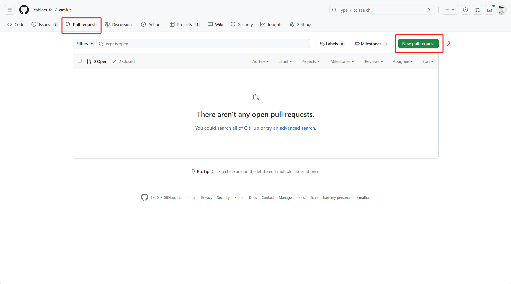
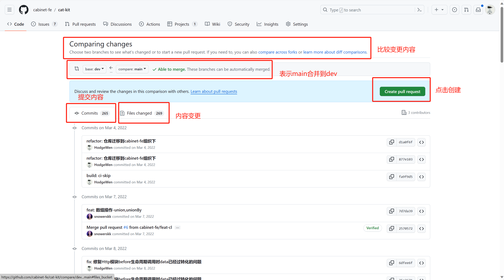

# 何为PR

PR是 pull request的缩写，含义是拉取请求。在git中拉取意味着代码的合并，因此你可以把PR理解为：代码贡献者请求代码审核者（仓库拥有者）合并贡献的代码。

PR发生在你fork的仓库，fork本意就是分叉的意思，你fork的仓库都会有原始仓库的信息，因此每个发起的pr都会被原仓库审核人看到。

## 新建PR

在仓库的TAB栏中点击 Pull requests栏，点击New pull request, 就是这么简单。只要你在该代码分支中改过代码，就会自动出现提交记录和代码的比较，点击Create pull request按钮就会发起一个PR。

 
