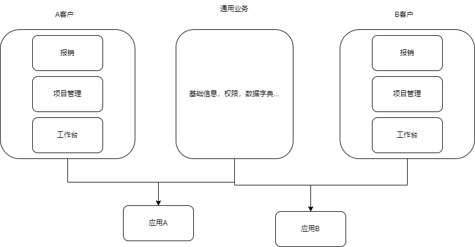

# 开发规范和详设

本文档提供开发规范和详细设计，每个点为何要这样设计都会给出具体的解释。

## 1. 技术选型和架构

项目类型绝大部分是管理类软件，多个软件间有重合和高度定制的部分。

后端使用Java和.Net开发。

前端使用TS开发。

### 1.1 通信方式

通信协议基于http。

**常见http状态码**（相当重要所有岗位都需要掌握）：

```JSON
/** 状态码 */
 {
  /** 请求头已接收 */
  "StatusContinue": 100, // RFC 7231, 6.2.1

  /** 请求成功完成 */
  "StatusOK": 200, // RFC 7231, 6.3.1

  /** 服务器的响应中不会包括任何内容 */
  "StatusNoContent": 204, // RFC 7231, 6.3.5

  /** 地址永久移动到了新的地址, Location头给出新的URI */
  "StatusMovedPermanently": 301, // RFC 7231, 6.4.2

  /** 资源未更改, 意味着从缓存中拿到资源 */
  "StatusNotModified": 304, // RFC 7232, 4.1

  // 客户端错误
  /** 错误的请求, 通常是请求参数错误 */
  "StatusBadRequest": 400, // RFC 7231, 6.5.1
  /** 未进行授权 */
  "StatusUnauthorized": 401, // RFC 7235, 3.1
  /** 拒绝请求，跟401类似，通常在安全软件拦截时可能出现 */
  "StatusForbidden": 403, // RFC 7231, 6.5.3
  /** 资源不存在 */
  "StatusNotFound": 404, // RFC 7231, 6.5.4
  /** 请求方法错误 */
  "StatusMethodNotAllowed": 405, // RFC 7231, 6.5.5

  /** 请求超时，通常是服务器未能在预期时间内处理完请求 */
  "StatusRequestTimeout": 408, // RFC 7231, 6.5.7

  /** 请求的URI太长，一般不会出现, 除非使用了非常长的查询参数 */
  "StatusRequestURITooLong": 414, // RFC 7231, 6.5.12

  // 服务器错误
  /** 内部服务器错误 */
  "StatusInternalServerError": 500, // RFC 7231, 6.6.1
  /** 错误网关，大部分情况就是服务挂掉了，负责网关和代理的服务器无法访问这些服务 */
  "StatusBadGateway": 502, // RFC 7231, 6.6.3
  /** 服务不可用或者过载了，通常发生在服务更新或维护期间 */
  "StatusServiceUnavailable": 503, // RFC 7231, 6.6.4
  /** 网关超时 */
  "StatusGatewayTimeout": 504, // RFC 7231, 6.6.5
  /** http版本不支持，现在基本上很少出现，早期http1.0往http1.1转换的时候可能回出现 */
  "StatusHTTPVersionNotSupported": 505, // RFC 7231, 6.6.6
}
```

数据交换格式统一使用JSON。

## 2. 开发规范

### 2.1 http请求和响应的数据结构

请求:

```json
{
  // 主表
  "baseInfo": {
    "name": "xxx项目",
    "startDate": 1706509491317,
    "endDate": 1707509491317,
    "amount": 25000000
  },

  // 子表
  "paymentPlan": [
    { "ratio": 0.3, "amount": 7500000 },
    { "ratio": 0.4, "amount": 10000000 },
    { "ratio": 0.3, "amount": 7500000 }
  ]
}
```

请求的格式是可以通过网页编辑器修改的。满足以下语法：

```ts
// JS对象语法
return {
  // 主表字段碾平至对象根属性下
  ...${state.formData.baseInfo},
  // 子表
  paymentPlan: state.formData.paymentPlan
}

// 上面的数据结构会被转化成下面这样
const requestJSON =  {
  "name": "xxx项目",
  "startDate": 1706509491317,
  "endDate": 1707509491317,
  "amount": 25000000,
  "paymentPlan": [
    { "ratio": 0.3, "amount": 7500000 },
    { "ratio": 0.4, "amount": 10000000 },
    { "ratio": 0.3, "amount": 7500000 }
  ]
}

```

响应格式:

```json
{
  // 数据
  "data": {
    "baseInfo": {
      "id": "1234567",
      "name": "xxx项目",
      "startDate": 1706509491317,
      "endDate": 1707509491317,
      "amount": 25000000
    },
    "paymentPlan": [
      { "ratio": 0.3, "amount": 7500000 },
      { "ratio": 0.4, "amount": 10000000 },
      { "ratio": 0.3, "amount": 7500000 }
    ]
  },
  // 错误提示信息
  "message": "..."
}
```
涉及到***增加***，***修改***的接口应该***返回入库后的数据***。涉及到***删除***的接口如果没有成功删除应该***报错***(通常为404和500两种错误)。

### 2.2 命名规范

::: danger 前言
无数的实践证明，不规范的命名是导致bug率和项目维护成本快速增高的最重要因素之一！
:::

在理解字段命名的重要性之前先来看一个错误的例子：

```json
{
  "xmmc": "",
  "xmdm": "",
  "xmbm": "",
  "xmdw": "",
  "bxbm": ""
}
```

上面的例子你能知道具体的含义吗？

再看下面的例子:

```json
{
  "projectName": "",
  "projectId": "",
  "contractId": "",
  "contractAmount": 0
}
```

上面的项目对象中的字段你能够分辨哪个是主键哪个是外键吗？

::: tip 软件开发速度由什么决定？
虽然不规范的命名在软件开发前期会提升开发效率，但难以贯穿整个软件生命周期。因为软件开发从来不是一个人的事情，命名规范可以影响后端，前端，测试，运维，实施，甚至产品。因此软件开发效率着重提高的是整个团队的开发效率。
:::

接下来讨论命名的一些原则：

1. 字段和变量等应该能够通过其命名知晓其表达的含义
2. 命名同时要兼顾简洁
3. 在一个对象中的字段应该能够让人清晰地分清主次

还是用表示一个项目的对象来举个例子，更好的做法应该如下方一样：

```json
{
  "name": "",
  "id": "",
  "contractId": "",
  "contractAmount": ""
}
```

对象本身已经用来表示项目，名称主键等其他有主语修饰的字段应该**丢弃主语**。

这样做的好处是：

1. 字段变得更加简洁，同时也不会失去其语义。
2. 当字段命名遵循一种约定俗成，就会大大减少沟通成本。
3. 对于低代码来讲，能够减少配置的复杂度，例如下拉选择器中的文本显示配置，子节点配置。
4. 可以清楚地知道哪些字段是内部的，哪些字段是外部的。

下面是一些常用的字段命名：

- 形容词。disabled(禁用的, 不可用的)，enabled(可用的), public(公用的，大众的), updated(已更新的)，frozen(已冻结的)。
- 名词。name(名称)，code（代码,代号），date(日期)，time(时间), year(年)，month(月), dateTime(年-月-日 时:分:秒)，amount(数量, 金额)，price(单价)，fee(费用)，remark(说明，备注)，number(编号), encoding(编码), type(类型), category(分类), status(状态)，children(子节点)。

### 2.3 接口风格

接口风格遵循RESTful设计原则。REST是一组单词(Representational State Transfer)的缩写, 直译就是具象状态传输，ful是单词后缀表示形容词。

对于RESTful我们无需理解单词的含义，而是理解为一种如何定位资源，如何操作资源，如何传输资源的一种规范。

RESTful设计原则：

- 用URI标识资源。在WEB中其实就是URL。

```
# URI示例
https://example.com/project/1
```

- 用http方法操作资源。

```yaml
# 读取资源
GET: https://example.com/project/1

# 更新资源
PUT: https://example.com/project/1

# 删除资源
DELETE: https://example.com/project/1

# 创建资源
POST: https://example.com/project

# 读取分页资源
GET: https://example.com/project/page
```

- 使用JSON进行数据交互

::: tip 对比

```yaml
# RESTful读取资源
GET: https://example.com/project/1

# 传统读取
GET: https://example.com/project/getInfoById?id=1
```

RESTful架构允许客户端和服务器之间的松散耦合，客户端可以独立地演化而不影响服务器，反之亦然。

RESTful架构中的资源和操作都是通过URI来表示，使得系统更加透明和易于理解。

当你想对创建资源和更新资源做权限控制时，传统API会更加难以维护。
:::

## 3. 模块设计

本次模块的设计追求解决以下遇到的痛点：

- 低代码配置复杂不够美观和直观，且配置项分散。
- 低代码配置无法支持组件类型的配置，同时也不支持子表的配置。
- 低代码不支持分页上按钮的配置，要支持可以配置内置功能(打印，导出，跳转路由，审批，删除等，[这些功能依赖API管理功能])。
- 表单路由无法缓存（可以增加钉住按钮，分页不缓存，表单缓存等逻辑）。
- 个性化配置的缺失问题。
- 后端部署复杂的问题(跨域，单独部署的服务[ureport, kkfileview]，将这些服务剔除自研)。
- 交互单调问题（适当增加动画交互效果）。
- 项目管理没有甘特图的问题。

## 4. 拆包

拆包是软件工程相当重要的一环，同样的模块不同逻辑应该通过不同的包组合而成，尽可能地减少迁出分支。



## 5. 测试

测试时测试环境应尽可能地和生产环境保持一致。

## 6. 其他规范

### 6.1 功能权限命名规则

应满足 —— [模块名的英文(下划线连接)]:[c / r / u / d]。

其中crud代表增删改查， 模块名的英文与模块管理中的模块标识保持一致。

例子：

```bash
payment_contract:c
payment_contract:d
payment_contract:u
payment_contract:r
```
