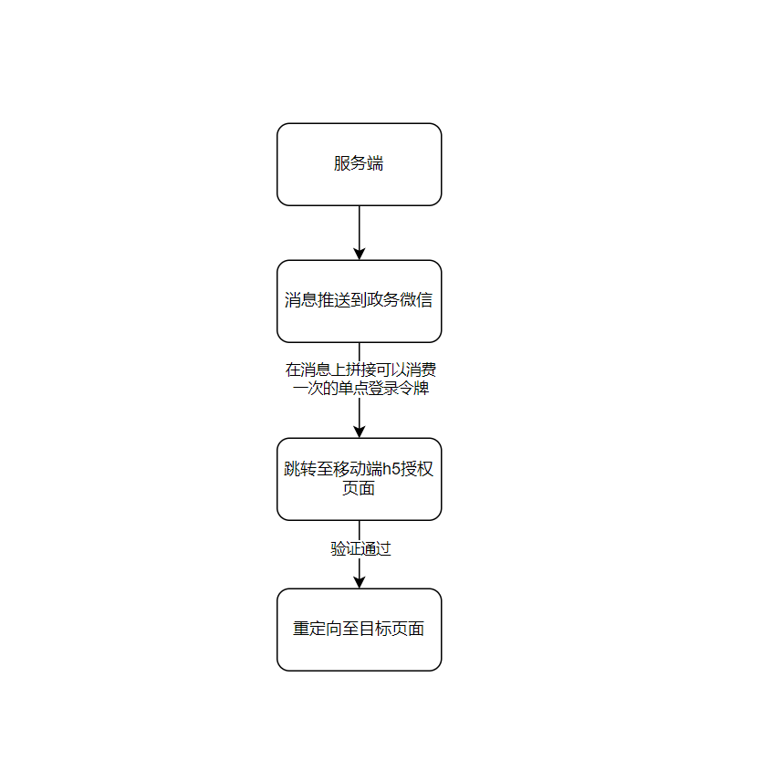
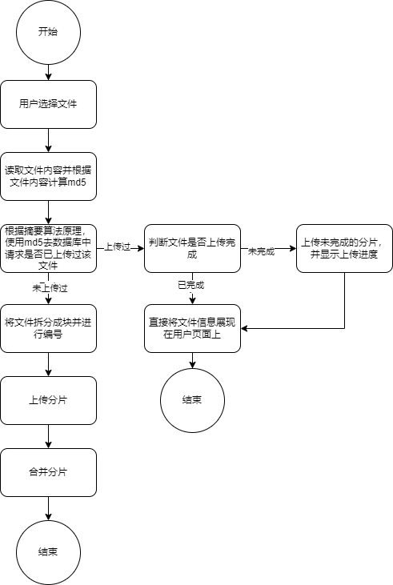

# 前端详细设计

## 1. 技术选型和架构

### 1.1 通信方式

使用HTTP协议，RESTFul交互风格，json格式进行数据交换。

### 1.2 技术栈

- node： 用于各种脚本工具开发。
- TypeScript： 编程语言，增强脚本语言的类型安全。
- Vue: 前端开发框架。
- CatKit开发工具箱（自研）：用于代码底层。
- Element Ultra组件库（自研）：用于页面的交互和展示。
- Echarts：用于大屏展示和统计图表。
- Crypto-js：用于数据加密和其他安全操作。
- xlsx：用于表格解析和写入。
- swiper：用于展示轮播图。
- nanoid: 用于生成唯一标识。
- vite: 用于开发和打包代码的开发工具。
- Vant: 移动端开发组件库

### 1.3 代码结构

现代web项目越来越复杂，本项目的代码结构将会弃用此前的单体结构，以MonoRepo的方式进行分包。

分包的好处在于：

- **代码共享和复用**：Monorepo允许多个项目共享代码库，这样可以避免代码重复，提高代码复用性，减少冗余代码的维护成本。

- **统一的开发环境**：Monorepo 提供了一个统一的开发环境，使得团队成员可以更轻松地协作开发，共享工具、配置和依赖项。

- **跨项目的重构和重构范围控制**：Monorepo 允许在多个项目中同时进行重构，从而提高了重构的效率。此外，由于代码库集中在一个仓库中，团队可以更好地控制重构的范围，减少了跨项目的重构所需的协调工作。

- **版本管理和依赖项管理**：Monorepo 可以更好地管理项目之间的依赖关系，避免了版本冲突和依赖项的混乱。通过共享依赖项，可以更容易地跟踪和管理依赖项的版本。

- **一致的构建和发布流程**：Monorepo 可以提供一致的构建和发布流程，简化了项目的构建和发布过程。这样可以减少配置和维护的工作量，并提高整体的开发效率。

本项目设计以下几个功能分包：

- **@ic/\***：业务包，存放各个业务页面的代码。
- **apis**: 接口包，存放和后端交互的各个接口代码。
- **assets**: 资源包，存放图片字体等静态资源。
- **cache**: 缓存包，存放web应用缓存管理程序代码。
- **components**: 业务组件包，存放可复用的页面级组件代码。
- **hooks**: 业务函数包，存放可复用的响应式组合函数代码。
- **lib**: 底层依赖库包，存放项目底层工具代码。
- **node-utils**: node脚本工具包，存放各种用于增强项目开发体验的工具代码。
- **pages**: 根页面包, 存放各个根页面的容器代码。
- **router**: 路由包，存放页面路由代码。
- **shared**: 共享包，存放各种环境配置，预设选项的代码。
- **store**: 状态仓库包，存放全局状态管理代码。
- **style**: 样式包，存放页面的样式代码。

接下来的几个小章节将会谈到以上分包具体的内容。

### 1.4 框架

框架使用Vue全家桶即： Vue3.x单文件组件(SFC) + VueRouter + Pinia + Vite。

之所以使用Vue作为开发框架，考虑以下几点原因：

- 工程师基数大，意味着团队更稳定。
- 开发体验优秀，和React不同的是Vue的状态数据是响应式的，写起来更加简洁。
- 更高的开发下限，Vue在模板编译上下了很大的功夫，大多数场景下无需手动优化性能，而新手使用React很容易写出性能较差的程序。
- 官方中文文档，尽管工程师需要经常看英文文档， 但是由官方推出的中文文档显然可以极大的增加开发效率。
- 丰富的生态系统，Vue拥有庞大而活跃的社区， 并且推出了数量相当可观的官方插件和工具。
- Vue被世界各地知名且多元的组织在生产环境中使用，包括 Wikimedia 基金会、美国宇航局、苹果、谷歌、微软、GitLab、Zoom、腾讯、微博、哔哩哔哩、快手等等。

### 1.5 状态管理

前端状态管理是构建大型应用程序时的关键问题之一，可以说现代管理系统的一半工作在状态管理上。

我们将状态管理提炼出几种方式：全局状态， 组件内部状态， 祖先状态。

全局状态使用Pinia进行封装，相比Vuex和其他的数据管理库，Pinia的使用更加贴近Vue本身，使用起来更加符合直觉。

组件内部状态使用Vue的响应式API，并且尽可能的不用事件将数据抛出，而是提供获取数据的接口。下面是一个例子：

```vue
<script lang="ts" setup>
const data = shallowRef<string[]>([])
defineExpose({
  // 数据在此处导出，从而与父组件解耦了
  // 组件只要是任何一个暴露了getData方法的组件即可
  getData() {
    return data
  }
})
</script>
```

组件状态使用依赖注入的方式，并且使用InjectionKey进行依赖注解，避免过多的心智负担。

### 1.6 路由

路由的设计遵循代码结构目录，并且使用脚本用于辅助生成：

例如代码目录是以下结构:

```bash

- reimburse
  - normal
    - main.vue
    - main-form.vue
  - travel
    - main.vue
    - main-form.vue
```

将会生成以下路由:

```ts
export const routes = [
  {
    path: 'reimburse/normal',
    component: Layout,
    children: [
      {
        path: '',
        component: () => import('@/ic/web/reimburse/normal/main.vue')
      },
      {
        path: '/create',
        component: () => import('@/ic/web/reimburse/normal/main-form.vue')
      },
      {
        path: '/:id/update',
        component: () => import('@/ic/web/reimburse/normal/main-form.vue')
      },
      {
        path: '/:id/view',
        component: () => import('@/ic/web/reimburse/normal/main-form.vue')
      },
      {
        path: '/:id/:instanceId/view',
        component: () => import('@/ic/web/reimburse/normal/main-form.vue')
      }
    ]
  },
  {
    path: 'reimburse/travel',
    component: Layout,
    children: [
      {
        path: '',
        component: () => import('@/ic/web/reimburse/travel/main.vue')
      },
      {
        path: '/create',
        component: () => import('@/ic/web/reimburse/travel/main-form.vue')
      },
      {
        path: '/:id/update',
        component: () => import('@/ic/web/reimburse/travel/main-form.vue')
      },
      {
        path: '/:id/view',
        component: () => import('@/ic/web/reimburse/travel/main-form.vue')
      },
      {
        path: '/:id/:instanceId/view',
        component: () => import('@/ic/web/reimburse/travel/main-form.vue')
      }
    ]
  }
]
```

为了实现这一点，将会编写一个用于生成路由的命令，并且会定义一些用于标记的特定语法。下面代码中的第一行(高亮行)不会参与实际渲染，看起来只是一个注释，但是它却能够告诉脚本这个代码会用来生成路由。

```vue {1}
<!-- <route-it title="通用报销" /> -->
<template></template>
```

### 1.7 移动端

PC端和移动端双端分两个独立的项目进行开发，但采用一致的路径，方便在政务微信中跳转。

移动端的免登通过单点登录方式实现。



### 1.8 版本控制

使用git作为版本控制工具（Git是目前世界上最先进的分布式版本控制系统，没有之一）。

采用双分支开发模式，dev分支用于开发并随时构建， 测试通过后将会被合并到main分支。

## 2. 组件

业务组件是复杂项目的基石，考虑到实际需求，我们将会实现一些通用的业务组件。

### 2.1 FormAttachment 表单附件

表单附件用于在页面上显示附件上传，展示以及预览。

考虑到附件的体积和优先的资源，将会使用断点续传和秒传这一技术来完成。下面是详细的交互步骤：



#### 2.1.1 使用示例

```vue
<template>
  <FormAttachment
    :code="code"
    :business-key="id"
    :editable="false"
    ref="attachRef"
  />
</template>

<script lang="ts" setup>
// ...
</script>
```

#### 2.1.2 功能列表

1. 附件和表单解耦以便后期维护。
2. 增加附件分类，并且每个分类可以配置上传的文件类型，是否必填。
3. 支持手机扫码上传。
4. 支持分片上传和秒传。
5. 支持并发上传。
6. 支持附件预览。
7. 支持审批中上传。
8. 支持补传附件。

#### 2.1.3 API设计

```ts
/**  附件数据类型 */
type FileItem = {
  /** 原附件 */
  file?: File
  /** 文件名称 */
  fileName: string
  /** 文件id */
  id: string
  /** 文件大小 */
  fileSize: number
  /** 文件的存储名称, 可以通过该名称直接访问文件 */
  hashName: string
  /** 创建人 */
  createBy: string
  /** 创建时间 */
  createAt: string
  /** 上传进度 */
  progress: number
  /** 状态 */
  status: FileStatus
  /** 消息 */
  msg: string
  /** 是否补传 */
  replenishFlag: boolean
  /** 文件md5摘要 */
  md5: string
}

/** 附件规则类型 */
type FileRule<T = FileItem> = {
  /** 规则名称 */
  rule: string
  /** 允许上传的文件类型列表 */
  accept: string[]
  /** 是否必须上传 */
  required: boolean
  /** 附件使用类别 */
  useClass: 'business' | 'approve'
  /** 附件使用类别名称 */
  useClassDesc: '一般业务' | '审批附件'
  /** 版本 */
  version: string
  /** 规则下的附件 */
  fileList: T[]
}

/** 附件属性 */
const FormAttachmentProps = {
  /** 审批任务id，用于查看审批记录中上传的附件 */
  taskId: {
    type: String
  },
  /** 模块标识，用于获取附件分类 */
  code: {
    type: String
  },
  /** 业务的主健，用于获取单子中上传的附件 */
  businessKey: {
    type: String
  },
  /** 是否可编辑 */
  editable: {
    type: Boolean,
    default: true
  },
  /** 是否是补传模式，补传模式下附件会有一个补传标记 */
  mode: {
    type: String as PropType<'sup' | 'normal'>,
    default: 'normal'
  },

  /** 附件规则api，以便不同的环境附件规则api自定义 */
  fileRuleApi: {
    type: String,
    default: `/admin/business-file/rule-file`
  }
}
```

#### 2.1.4 性能优化

在大多数情况下，上传文件的性能是不容易被感知的，但是在上传超大文件时会很明显的感觉页面卡顿，这是由于JS是单线程的，计算大文件的md5时需要进行大量的计算，这种CPU密集型的操作往往能够带来明显的网页性能下降，因此文件上传的md5计算操作将会用web worker线程去完成。不仅如此，考虑到网络并发问题，我们将会采用自研的页面内并发API来完成并发上传的问题。

md5 web worker线程读取示例：

```ts
// file.worker.ts

async function calcMD5(file: File, chunkSize: number) {
  // ...代码实现逻辑
}

// 响应主线程的通信
onmessage = async function (e) {
  const md5 = await calcMD5(e.data)
  postMessage(md5)
}
```

并发API示例：

```ts
const cc = new ConcurrenceController({
  // 并发队列
  queue: [],
  // 每个并发执行方法
  async action() {},
  // 最大并发数
  max: 8,
  // 并发模式，如果有失败的任务也会继续执行剩下的
  mode: 'continue'
})

cc.on('success', e => {
  // 逻辑代码
})

// 开始并发
cc.start()

// 暂停并发
cc.pause()
```

### 2.2 CodeEditor 代码编辑器

代码编辑器底层基于monaco-editor, 用于写入一些表达式， 比如审批流部分脚本的配置等等。

#### 2.2.1 使用示例

```vue
<template>
  <CodeEditor
    language="expression"
    style="height: 400px"
    v-model="code"
    theme="vs"
  />
</template>

<script lang="ts">
const code = ref('')
</script>
```

#### 2.2.2 功能列表

1. 支持语法高亮(HTML, JS, CSS, TS, Vue, Java, Expression)。
2. 支持代码提示和补全。
3. 支持主题切换

#### 2.2.3 API设计

```ts
/** 支持的语言类型 */
type Lang =
  | 'typescript'
  | 'javascript'
  | 'json'
  | 'html'
  | 'java'
  | 'expression'

/** 支持的主题 */
type Theme = 'vs' | 'vs-dark'

/** 代码编辑器属性 */
const CodeEditorProps = {
  /** 内容 */
  modelValue: {
    type: String
  },

  /** 语言 */
  language: {
    type: String as PropType<Lang>,
    default: 'typescript'
  },

  /** 主题 */
  theme: {
    type: String as PropType<Theme>,
    default: 'vs-dark'
  },

  /** 语法提示获取 */
  suggestionsGetter: {
    type: Function as PropType<SuggestionGetter>
  }
}

/** 事件 */
const emit = defineEmits<{
  (e: 'update:modelValue', value: string): void
}>()
```

### 2.3 CommonActions 通用操作按钮

CommonActions组件将大部分常用按钮封装，包含编辑，删除，查看，审核，补传附件， 流程图查看，追回，作废，激活，消审，通过，退回，打印。

按钮作为和用户交互的最常见的元素无处不在，但是有很大一部分的按钮职责类似，名称一致，因此将这些常用按钮封装为一个组件能够极大的复用代码并提升开发效率。

#### 2.3.1 使用示例

```vue
<template>
  <CommonActions
    inline
    :row="row"
    feat-sup
    feat-view
    feat-delete
    feat-update
    @view="handleView(row)"
    @update="handleUpdate(row)"
    @delete="handleDelete(row)"
    @audit="handleAudit(row)"
  />
</template>

<script lang="ts"></script>
```

#### 2.3.2 功能列表

1. 支持常用按钮权限和显示条件配置。
2. 支持按钮的事件触发配置。
3. 支持表格内展示和表单内展示。
4. 支持按钮别名。
5. 包含编辑，删除，查看，审核，补传附件， 流程图查看，追回，作废，激活，消审，通过，退回，打印这些按钮。

#### 2.3.3 API设计

```ts
/** 属性 */
const commonActionsProps = {
  /** 是否表格行内显示 */
  inline: Boolean,

  /** 权限控制相关的属性, 查看 */
  featView: {
    type: [Boolean, String],
    default: false
  },

  /** 权限控制相关的属性, 补传附件 */
  featSup: {
    type: [Boolean, String],
    default: false
  },

  /** 权限控制相关的属性, 编辑 */
  featUpdate: {
    type: [Boolean, String],
    default: false
  },

  /** 权限控制相关的属性, 删除 */
  featDelete: {
    type: [Boolean, String],
    default: false
  },

  /** 权限控制相关的属性, 审核 */
  featAudit: {
    type: [Boolean, String],
    default: true
  },

  /** 权限控制相关的属性, 作废 */
  featInvalid: {
    type: [Boolean, String],
    default: false
  },

  /** 权限控制相关的属性, 激活 */
  featActive: {
    type: [Boolean, String],
    default: false
  },

  /** 权限控制相关的属性, 流程图 */
  featProcess: {
    type: [Boolean, String],
    default: true
  },
  /** 权限控制相关的属性, 消审 */
  featCancel: {
    type: [Boolean, String],
    default: true
  },
  /** 权限控制相关的属性, 追回 */
  featRestart: {
    type: [Boolean, String],
    default: true
  },

  /** 别名, e.g: { '查看': '详情' } */
  alias: {
    type: Object as PropType<Record<string, string | null>>
  },

  /** 批量审批 */
  batch: Boolean,

  /** 批量审批按钮是否不可点击 */
  batchDisabled: Boolean,

  /** 行数据, 在打印功能中引入 */
  row: {
    type: Object as PropType<{
      [key: string]: any
    }>
  },

  /** 业务键，在非行内中使用 */
  businessKey: {
    type: String
  },

  /** 权限控制相关的属性, 打印 */
  featPrint: {
    type: Boolean,
    default: true
  },

  /** 权限控制相关的属性, 退回至审批人 */
  featRejectApprover: {
    type: [Boolean, String],
    default: false
  },

  /** 任务id用来判断审核按钮是否显示 */
  taskId: {
    type: String
  }
}

/** 审批命令 */
type Command =
  | 'view-process'
  | 'cancel'
  | 'invalid'
  | 'active'
  | 'remove'
  | 'approve'
  | 'reject'
  | 'transfer'

/** 事件 */
const commonActionsEmits = {
  view: () => true,
  update: () => true,
  delete: () => true,
  audit: () => true,
  sup: () => true,
  command: (command: Command) => true
}
```

### 2.4 BPMN 流程组件

BPMN是一套工作流程的规范，该组件和规范同名，提供配置审批流程模型的交互功能。

#### 2.4.1 使用示例

```vue
<template>
  <Bpmn
    :title="data?.model?.name"
    @save="handleSave"
    :data="data"
    @save-and-publish="handleSaveAndPublish"
  />
</template>
```

#### 2.4.2 功能列表

1. 支持开始事件，结束事件，排他网关，并行网关，用户任务，顺序流。
2. 用户任务支持配置人员，审批要素。
3. 支持模型校验。
4. 支持模型文件导入导出。
5. 支持保存和发布。
6. 支持放大和缩小。
7. 支持历史操作记录。
8. 支持快捷键：偏移抓手，选取， 删除节点，上一步，下一步，打开帮助，复制，粘贴，放大，缩小。

#### 2.4.3 API设计

```ts
/** 模型信息 */
type ModelInfo = {
  model: {
    /** 模型xml字符串 */
    xml: string
    /** 模型类别id */
    typeId: string
    /** 模型类别 */
    modelType: string
    /** 模型key */
    modelKey: string
    /** 流程名称 */
    name: string
    /** 描述 */
    description: string
    /** 类型key? */
    typeKey: string
    /** modelId */
    modelId?: string
  }
  /** 审批要素 */
  factor: Array<{
    id: string
    factor: string
    factorKey: string
    modelId: string
    nodeKey: string
  }>
  /** 审批脚本 */
  script: Array<{
    nodeKey: string
    nodeKeyName: string
  }>
}

/** 属性 */
const BPMNProps = {
  /** 模型标题 */
  title: {
    type: String
  },

  /** 模型数据 */
  data: {
    type: Object as PropType<ModelInfo>,
    default: () => ({
      model: {
        xml: '',
        modelKey: ''
      },
      script: [],
      factor: []
    })
  }
}

/** 事件 */
const emit = defineEmits({
  /** 保存 */
  save: (data: any) => true,
  /** 保存并发布 */
  'save-and-publish': (data: any) => true
})
```

### 2.5 EditableText 可编辑文本组件

可编辑文本组件用于提供给用户更简单直接的编辑体验，通过直接点击文本进入编辑状态。

#### 2.5.1 使用示例

```vue
<template>
  <EditableText v-model="text" />
</template>
```

#### 2.5.2 功能列表

1. 支持点击文本切换值输入框输入。
2. 支持回车或者输入框失焦时切换为展现模式。

#### 2.5.3 API设计

```ts
/** 属性 */
const EditableTextProps = {
  modelValue: {
    type: String
  },
  /** 是否可编辑 */
  editable: {
    type: Boolean
  }
}

/** 事件 */
const emit = defineEmits<{
  (e: 'update:modelValue', text: string): void
  (e: 'update:editable', value: boolean): void
  (e: 'change'): void
}>()
```

### 2.6 GridInput 块型输入组件

块型输入组件用于输入一些验证码等固定格式固定长度的文本。

#### 2.6.1 使用示例

```vue
<template>
  <GridInput separator="" @input="" />
</template>
```

#### 2.6.2 功能列表

1. 支持指定长度。
2. 支持定义分隔符。
3. 支持方向按键切换格子。

#### 2.6.3 API设计

```ts
/** 属性 */
const GridInputProps = {
  /** 值 */
  value: {
    type: String,
    default: ''
  },
  /** 输入长度 */
  length: {
    type: Number,
    default: 6
  },
  /** 是否能够输入数字0 */
  zero: {
    type: Boolean,
    default: false
  },
  /** 生成内容的分隔符 */
  separator: {
    type: String,
    default: '-'
  }
}

/** 事件 */
const emit = defineEmits<{
  (e: 'input', data: string): void
}>()
```

### 2.7 Importer 导入组件

导入组件用于导入excel数据到业务表中。

#### 2.7.1 使用示例

```vue
<template>
  <Importer ref="importerRef" />

  <el-button
    @click="
      importerRef?.open({
        importApi: 'xxx',
        templateUrl: 'xxx',
        formCode: 'xx'
      })
    "
    >导入</el-button
  >
</template>

<script lang="ts" setup>
const importerRef = shallowRef()
</script>
```

#### 2.7.2 功能列表

1. 支持指定导入接口从而导入不同的业务数据。
2. 支持指定模板接口从而可以下载不同的导入模板。
3. 支持导入数据预览。
4. 支持拖拽导入。
5. 支持显示导入失败的数据列表。
6. 支持导入失败后重新上传导入。

#### 2.7.3 API设计

```ts
interface ImportOptions {
  /** 导入接口 */
  importApi: string
  /** 模板下载地址 */
  templateUrl?: string
  /** 模块编码 */
  formCode: string
}

/** 方法  */
defineExpose({
  /** 打开导入弹框 */
  open(options: ImportOptions) {}
})
```

### 2.8 Exporter 导出组件

导出组件用于导出业务数据为excel，csv等文件。

#### 2.8.1 使用示例

```vue
<template>
  <Exporter ref="exporterRef" />
</template>

<script lang="ts" setup>
const exporterRef = shallowRef()
</script>
```

#### 2.8.2 功能列表

1. 支持指定导出文件的名称。
2. 支持选择导出的列。
3. 支持选择数据导出。
4. 支持配置导出接口
5. 支持配置查询参数导出。

#### 2.8.3 API设计

```ts
/** 导出选项 */
type ExportOptions = {
  /** 导出的列配置 */
  columns?: (ProTableColumn & { preset?: string })[]
  /** 导出数据 */
  data?: any[]
  /** 导出总数 */
  total?: number
  /** 导出接口 */
  exportApi?: string
  /** 查询条件 */
  query?: Record<string, any>
  /** 导出的文件的名称 */
  nameOfExportedFile?: string
}
/** 方法 */
defineExpose({
  open(options: ExportOptions) {}
})
```

### 2.9 Invoice 发票组件

发票组件用于统一控制各种发票的识别和上传入库。

发票组件底层基于附件上传组件，也一样支持秒传和发票预览。

#### 2.9.1 使用示例

```vue
<template>
  <Invoice ref="invoiceRef" business-id="xxx" :editable="false" />
</template>

<script lang="ts" setup>
const invoiceRef = shallowRef()
</script>
```

#### 2.9.2 功能列表

1. 支持发票上传和识别。
2. 支持使用自定义识别模型。
3. 支持发票的类型指定。
4. 支持识别失败后自定义填写发票数据。
5. 支持发票预览。
6. 支持本地上传识别和扫码上传识别。
7. 支持发票金额合计。

#### 2.9.3 API设计

```ts
/** 属性 */
const InvoiceProps = {
  /** 发票关联的业务id */
  businessId: {
    type: String
  },
  /** 是否可编辑 */
  editable: {
    type: Boolean,
    default: true
  },
  /** 控制发票接收的文件上传类型 */
  accept: {
    type: Array,
    default: () => []
  }
}

/** 方法 */
defineExpose({
  /** 获取发票数据 */
  getInvoiceData() {}
})
```

### 2.10 ProcessViewer 流程查看组件

流程查看组件用于审批过程中查看审批进度和审批记录。

#### 2.10.1 使用示例

```vue
<template>
  <ProcessViewer ref="processRef" />
</template>

<script lang="ts" setup>
const processRef = shallowRef()
</script>
```

#### 2.10.2 功能列表

1. 支持展示流程图的所有节点。
2. 支持展现流程图当前的进度并提供动画交互效果。
3. 支持配置网格背景效果。
4. 支持缩放操作。

#### 2.10.3 API设计

```ts
/** 属性 */
const ProcessViewerProps = {
  /** 流程图渲染文件 */
  xml: {
    type: String,
    required: true
  },

  /** 渲染前钩子 */
  beforeDraw: {
    type: Function
  },

  /** 是否显示网格 */
  showGrid: {
    type: Boolean,
    default: false
  }
}

/** 方法 */
defineExpose({
  /** 侦听事件 */
  on() {},
  /** 移除事件 */
  off() {},
  /** 缩放 */
  zoom() {},
  /** 绘制 */
  draw() {},
  /** 清空 */
  clear() {}
})
```

### 2.11 ReviewTag 审批状态标签组件

审批状态标签用于展示不同状态的样式。

#### 2.11.1 使用示例

```vue
<template>
  <ReviewTag status="checked" />
</template>

<script lang="ts" setup></script>
```

#### 2.11.2 功能列表

1. 支持根据不同的状态显示不同的样式效果

#### 2.11.3 API设计

```ts
const ReviewTagProps = {
  /** 状态 */
  status: {
    type: String,
    default: 'unknown'
  }
}
```

### 2.12 Printer 打印组件

打印组件用于打印一条或多条数据。并支持输出对应的文件格式内容。

#### 2.12.1 使用示例

```vue
<template>
  <Printer ref="printerRef" @print="" />
</template>

<script lang="ts" setup>
const printerRef = shallowRef()
</script>
```

#### 2.12.2 功能列表

1. 支持配置打印列表。
2. 支持打印参数自定义。
3. 支持多种打印模板配置。

#### 2.12.3 API设计

```ts
type PrintItem = {
  /** 打印名称 */
  name: string
  /** 打印路径 */
  printPath: string
}

interface Options {
  /** 打印列表, 打印时可能有多种打印方式 */
  printList: PrintItem[]
}

/** 方法 */
defineExpose({
  open(options: Options) {}
})
```

### 2.13 BusinessPage 业务分页组件

业务分页组件是整个系统最核心，封装度最高的组件之一。
底层基于已经集成后的表格组件ProTable,是抽象所有业务分页页面后的统一封装的组件。

#### 2.13.1 使用示例

```vue
<template>
  <BusinessPage code="code">
    <!-- 定义工具 -->
    <template #tools></template>

    <!-- 定义每一行的操作按钮 -->
    <template #action="{ row }"></template>
  </BusinessPage>
</template>

<script lang="ts" setup></script>
```

#### 2.13.2 功能列表

1. 支持传入模块标识来获取页面的列配置信息（列的名称，对齐，宽度，顺序等）。
2. 支持配置分页的接口地址来获得不同的数据。
3. 支持配置操作栏最大按钮数量。
4. 支持配置表尾合计行。
5. 支持配置显示序号。
6. 支持配置是否可以多选或单选。
7. 支持配置分页的查询条件。

#### 2.13.3 API设计

```ts
/** 属性 */
const BusinessPageProps = {
  /** 模块标识 */
  code: {
    type: String,
    required: true
  },

  /** 自定义列渲染 */
  columnsRender: {
    type: Object as PropType<
      Record<string, (ctx: { val: any; index: number; row: any }) => any>
    >
  },

  /**
   * 自定义分页配置，优先级大于模块标识中的配置。
   */
  pageConfig: {
    type: Object as PropType<ShallowReactive<PageConfig>>
  },

  /** 查询条件配置 */
  query: {
    type: Object as PropType<Record<string, any>>
  }
}

/** 事件 */
const BusinessPageEmits = {
  /** 多选 */
  check: (checked: any[]) => true,
  /** 单选 */
  select: (selected: any) => true,
  /** 数据加载 */
  ready: (data: { moduleData; metaData }) => true
}

/** 方法 */
defineExpose({
  /** 获取数据 */
  fetchData() {}
})
```

### 2.14 BusinessForm 业务表单组件

业务表单和业务分页组件一样，属于高度封装组件，都是为了加快迭代速度而封装的。

#### 2.14.1 使用示例

```vue
<template>
  <BusinessForm
    ref="businessFormRef"
    code="code-xxx"
    business-key="xxx"
    :editable="false"
  >
  </BusinessForm>
</template>

<script lang="ts" setup></script>
```

#### 2.14.2 功能列表

1. 支持配置表单项的名称。
2. 支持配置表单名称宽度。
3. 支持配置表单项的提示消息配置。
4. 支持配置表单项是否必填配置。
5. 支持配置表单项是否显示。
6. 支持配置选择器的数据选项。
7. 支持配置日期的格式。
8. 支持配置表单的附件。
9. 支持配置文件的渲染。

#### 2.14.3 API设计

```ts
interface FormConfig {
  /** 页面版块列表 */
  parts: FormPart[]
  /** 是否显示附件 */
  showInvoice: boolean
  /** 附件接受文件类型 */
  invoiceAccept: string[]
  /** 显示审批记录 */
  showAuditRecords: boolean
  /** 附件 */
  showAttach: boolean
  /** label宽度 */
  labelWidth?: number
  /** 业务指南 */
  businessGuide?: string
}

/** 属性 */
const BusinessFormProps = {
  /** 模块标识 */
  code: {
    type: String,
    required: true
  },

  /** 表单配置项, 只用于配置页面 */
  formConfig: {
    type: Object as PropType<FormConfig>
  },

  /** 业务主健 */
  businessKey: {
    type: String
  },

  /** 字段事件 */
  fieldsEvent: {
    type: Object
  },

  /** 隐藏附件 */
  hideAttach: {
    type: Boolean
  },

  /** 可编辑状态 */
  editable: {
    type: Boolean,
    default: true
  },

  /** 附件可编辑 */
  attachEditable: {
    type: Boolean,
    default: undefined
  },

  /** 回显的数据 */
  data: {
    type: Object
  }
}
```

## 3. 页面

### 3.1 登录

#### 路由

/login

#### 功能需求

- 账号密码输入登录系统。

### 3.2 单点登录

#### 路由

/sso-login

#### 功能需求

- 提供无须账号密码进入系统的授权方式。

### 3.2 工作台

#### 路由

/home/workbench

#### 功能需求

- 待办工作。可以在这里查看和查询待办事项和已办事项，提供办事的入口（按钮）， 以及查看每个事项的办理进度。
- 常用功能。可以在此处配置各种常用的功能模块， 方便快速进入。
- 工作动态。用来显示一些广播内容和站内消息等。

### 3.4 基础信息-数据字典

#### 路由

/common/basic/dict

#### 功能需求

- 查询数据字典。
- 添加，修改和删除数据字典。
- 查询数据字典项。
- 配置数据字典项。
- 字典项要求为树形结构。
- 字典项可以排序，可以在不同的位置插入字典项。

### 3.5 基础信息-编码规则

#### 路由

/common/basic/code-rule

#### 功能需求

- 查询编码规则。
- 添加，修改和删除编码规则。
- 编码规则由常量，日期，自增序列自由排列组成。

#### 3.6 基础信息-日志管理

#### 路由

/common/basic/log

#### 功能需求

- 查询数据请求日志。
- 需要显示请求的IP地址，请求时间，请求的服务端接口，操作人， 操作机器。
- 日志卸初以便于释放存储空间。

### 3.7 系统管理-角色管理

#### 路由

/common/system/role

#### 功能需求

- 查询角色列表。
- 添加，修改和删除角色。
- 给角色授予功能权限和数据权限。
- 数据权限支持，所有数据，单位级以下， 本级及下级，本人，手动选择5种选项。

### 3.8 系统管理-部门管理

#### 路由

common/system/org/dept

#### 功能需求

- 查询部门数据。
- 新增和编辑部门数据。
- 支持设置部门名称，负责人， 分管领导，岗位。
- 部门列表以树形结构展示。

### 3.9 系统管理-职工子女管理

#### 路由

/common/system/offspring

#### 功能需求

- 查询职工子女数据。
- 新增，编辑和删除职工子女。
- 子女可以填写多个，并需要填写每个子女的姓名，性别，出生日期（年月日）。

### 3.10 系统管理-单位管理

#### 路由

/common/system/org

#### 功能需求

- 查询单位数据。
- 新增和编辑单位数据。
- 支持设置单位名称，负责人， 分管领导，岗位。
- 单位列表以树形结构展示。

### 3.10 系统管理-用户管理

#### 路由

/common/system/user

#### 功能需求

- 查询系统用户。
- 新增，编辑和删除用户。
- 可以授权其他用户自己的权限。
- 支持导入用户。
- 支持填写用户银行卡信息。

### 3.11 系统管理-权限管理

#### 路由
/common/system/permission
#### 功能需求
- 查询系统的菜单和功能权限。
- 新增，编辑和删除菜单及功能权限。
### 3.12 报表设计

#### 路由

#### 功能需求

### 3.13 报销管理-通用报销

#### 路由

#### 功能需求

### 3.14 报销管理-保育费报销

#### 路由

#### 功能需求

### 3.15 报销管理-子女医药费报销

#### 路由

#### 功能需求

### 3.16 报销管理-子女医保费报销

#### 路由

#### 功能需求

### 3.17 报销管理-会议费报销

#### 路由

#### 功能需求

### 3.18 报销管理-公务接待费报销

#### 路由

#### 功能需求

### 3.19 报销管理-用款计划单报销

#### 路由

#### 功能需求

### 3.20 报销管理-职工医药费报销

#### 路由

#### 功能需求

### 3.21 报销管理-培训费报销

#### 路由

#### 功能需求

### 3.22 报销管理-市内交通费报销

#### 路由

#### 功能需求

### 3.23 报销管理- 差旅费报销

#### 路由

#### 功能需求

## 4. 界面

### 4.1 颜色

颜色主要有5种：1个主要颜色，4个辅助色。

主要颜色十六进制值：#409eff。

辅助色十六进制值：(成功色: #67C23A), (警告色: #E6A23C), (危险色: #F56C6C), (信息色: #909399)。

其中主要颜色在系统的设置种可以配置。


### 4.2 字体

字体家族配置如下:

```css
font-family: 'Helvetica Neue', Helvetica, 'PingFang SC', 'Hiragino Sans GB',
  'Microsoft YaHei', '微软雅黑', Arial, sans-serif;
```

### 4.3 布局

系统整体布局采用上下和左右两栏式布局，这也是目前比较主流的布局方案之一。


### 4.4 图标

图标采用彩色但简洁的风格。


除此之外，还将提供图标上传功能，先将将上传的图标文件转化为base64格式，然后通过后端接口保存至数据库中。

### 4.5 个性化

点击设置按钮即可进入个性化配置页面。个性化配置提供以下四种配置：

1. 紧凑度配置，有紧凑，标准，松散三种选项，默认为标准。越紧凑显示的内容越多，反之则越少。
2. 主题色配置，默认主题色为蓝色。
3.

## 5. 用户交互
### 5.1 用户操作流程
### 5.2 表单和输入验证
### 5.3 错误处理
### 5.4 通知和提示


