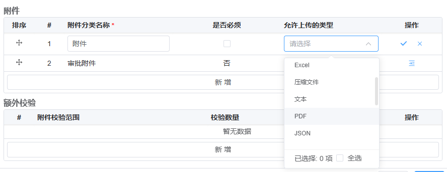

# 前端详细设计

## 1 技术选型和架构

### 1.1 通信方式

使用HTTP协议，RESTFul交互风格，json格式进行数据交换。

### 1.2 技术栈

- node： 用于各种脚本工具开发。
- TypeScript： 编程语言，增强脚本语言的类型安全。
- Vue: 前端开发框架。
- CatKit开发工具箱（自研）：用于代码底层。
- Element Ultra组件库（自研）：用于页面的交互和展示。
- Echarts：用于大屏展示和统计图表。
- Crypto-js：用于数据加密和其他安全操作。
- xlsx：用于表格解析和写入。
- swiper：用于展示轮播图。
- nanoid: 用于生成唯一标识。
- vite: 用于开发和打包代码的开发工具。

### 1.3 代码结构

现代web项目越来越复杂，本项目的代码结构将会弃用此前的单体结构，以MonoRepo的方式进行分包。

分包的好处在于：

- **代码共享和复用**：Monorepo允许多个项目共享代码库，这样可以避免代码重复，提高代码复用性，减少冗余代码的维护成本。

- **统一的开发环境**：Monorepo 提供了一个统一的开发环境，使得团队成员可以更轻松地协作开发，共享工具、配置和依赖项。

- **跨项目的重构和重构范围控制**：Monorepo 允许在多个项目中同时进行重构，从而提高了重构的效率。此外，由于代码库集中在一个仓库中，团队可以更好地控制重构的范围，减少了跨项目的重构所需的协调工作。

- **版本管理和依赖项管理**：Monorepo 可以更好地管理项目之间的依赖关系，避免了版本冲突和依赖项的混乱。通过共享依赖项，可以更容易地跟踪和管理依赖项的版本。

- **一致的构建和发布流程**：Monorepo 可以提供一致的构建和发布流程，简化了项目的构建和发布过程。这样可以减少配置和维护的工作量，并提高整体的开发效率。

本项目设计以下几个功能分包：

- **@ic/\***：业务包，存放各个业务页面的代码。
- **apis**: 接口包，存放和后端交互的各个接口代码。
- **assets**: 资源包，存放图片字体等静态资源。
- **cache**: 缓存包，存放web应用缓存管理程序代码。
- **components**: 业务组件包，存放可复用的页面级组件代码。
- **hooks**: 业务函数包，存放可复用的响应式组合函数代码。
- **lib**: 底层依赖库包，存放项目底层工具代码。
- **node-utils**: node脚本工具包，存放各种用于增强项目开发体验的工具代码。
- **pages**: 根页面包, 存放各个根页面的容器代码。
- **router**: 路由包，存放页面路由代码。
- **shared**: 共享包，存放各种环境配置，预设选项的代码。
- **store**: 状态仓库包，存放全局状态管理代码。
- **style**: 样式包，存放页面的样式代码。

接下来的几个小章节将会谈到以上分包具体的内容。

### 1.4 框架

我们使用Vue作为我们的开发框架，这样做的原因有：

- 工程师基数大，意味着团队更稳定。
- 开发体验优秀，和React不同的是Vue的状态数据是响应式的，写起来更加简洁。
- 官方中文文档，尽管工程师需要经常看英文文档， 但是由官方推出的中文文档显然可以极大的增加开发效率。
- 丰富的生态系统，Vue拥有庞大而活跃的社区， 并且推出了数量相当可观的官方插件和工具。

### 1.5 状态管理

前端状态管理是构建大型应用程序时的关键问题之一，可以说现代管理系统的一半工作在状态管理上。

我们将状态管理提炼出几种方式：全局状态， 组件内部状态， 祖先状态。

全局状态使用Pinia进行封装，相比Vuex和其他的数据管理库，Pinia的使用更加贴近Vue本身，使用起来更加符合直觉。

组件内部状态使用Vue的响应式API，并且尽可能的不用事件将数据抛出，而是提供获取数据的接口。下面是一个例子：

```vue
<script lang="ts" setup>
const data = shallowRef<string[]>([])
defineExpose({
  // 数据在此处导出，从而与父组件解耦了
  // 组件只要是任何一个暴露了getData方法的组件即可
  getData() {
    return data
  }
})
</script>
```

组件状态使用依赖注入的方式，并且使用InjectionKey进行依赖注解，避免过多的心智负担。

### 1.6 路由

路由的设计遵循代码结构目录，并且使用脚本用于辅助生成：

例如代码目录是以下结构:

```bash

- reimburse
  - normal
    - main.vue
    - main-form.vue
  - travel
    - main.vue
    - main-form.vue
```

将会生成以下路由:

```ts
export const routes = [
  {
    path: 'reimburse/normal',
    component: Layout,
    children: [
      {
        path: '',
        component: () => import('@/ic/web/reimburse/normal/main.vue')
      },
      {
        path: '/create',
        component: () => import('@/ic/web/reimburse/normal/main-form.vue')
      },
      {
        path: '/:id/update',
        component: () => import('@/ic/web/reimburse/normal/main-form.vue')
      },
      {
        path: '/:id/view',
        component: () => import('@/ic/web/reimburse/normal/main-form.vue')
      },
      {
        path: '/:id/:instanceId/view',
        component: () => import('@/ic/web/reimburse/normal/main-form.vue')
      }
    ]
  },
  {
    path: 'reimburse/travel',
    component: Layout,
    children: [
      {
        path: '',
        component: () => import('@/ic/web/reimburse/travel/main.vue')
      },
      {
        path: '/create',
        component: () => import('@/ic/web/reimburse/travel/main-form.vue')
      },
      {
        path: '/:id/update',
        component: () => import('@/ic/web/reimburse/travel/main-form.vue')
      },
      {
        path: '/:id/view',
        component: () => import('@/ic/web/reimburse/travel/main-form.vue')
      },
      {
        path: '/:id/:instanceId/view',
        component: () => import('@/ic/web/reimburse/travel/main-form.vue')
      }
    ]
  }
]
```

为了实现这一点，将会编写一个用于生成路由的命令，并且会定义一些用于标记的特定语法。下面代码中的第一行(高亮行)不会参与实际渲染，看起来只是一个注释，但是它却能够告诉脚本这个代码会用来生成路由。

```vue {1}
<!-- <route-it title="通用报销" /> -->
<template></template>
```

## 2 组件设计

业务组件是复杂项目的基石，考虑到实际需求，我们将会实现一些通用的业务组件

### 2.1 FormAttachment 表单附件

表单附件用于在页面上显示附件上传，展示以及预览。

考虑到附件的体积和优先的资源，将会使用断点续传和秒传这一技术来完成。下面是详细的交互步骤：


#### 2.1.1 通用性设计

为了组件的通用性和业务的可维护性，附件和表单解耦，不依赖特定业务。每个附件关联业务数据的一个唯一性字段（通常是id），这样每次查看单子时只要根据业务唯一性字段来查询有哪些附件即可。

不仅如此，考虑到每个附件可能会有分类，我们在附件之上还设计了一层附件类别，附件类别的作用不仅仅用于分类，还可以配置该类附件是否必传，允许上传的类型。

设计图：



#### 2.1.2 易用性设计

有时候我们需要上传的附件在手机中，或者需要用手机拍照上传，我们设计了一个扫码上传功能，方便用户拍照上传附件或者上传手机本地附件。

同样的，对于很多附件的预览也是相当重要的，本组件被设计为可以预览word, excel, txt文本，视频，图片，pdf等常用的文件格式。

设计图：


#### 2.1.3 性能优化

在大多数情况下，上传文件的性能是不容易被感知的，但是在上传超大文件时会很明显的感觉页面卡顿，这是由于JS是单线程的，计算大文件的md5时需要进行大量的计算，这种CPU密集型的操作往往能够带来明显的网页性能下降，因此文件上传的md5计算操作将会用web worker线程去完成。不仅如此，考虑到网络并发问题，我们将会采用自研的页面内并发API来完成并发上传的问题。

md5 web worker线程读取示例：

```ts
// file.worker.ts

async function calcMD5(file: File, chunkSize: number) {
  // ...代码实现逻辑
}

// 响应主线程的通信
onmessage = async function (e) {
  const md5 = await calcMD5(e.data)
  postMessage(md5)
}
```

并发API示例：

```ts
const cc = new ConcurrenceController({
  // 并发队列
  queue: [],
  // 每个并发执行方法
  async action() {},
  // 最大并发数
  max: 8,
  // 并发模式，如果有失败的任务也会继续执行剩下的
  mode: 'continue'
})

cc.on('success', e => {
  // 逻辑代码
})

// 开始并发
cc.start()

// 暂停并发
cc.pause()
```

### 2.2 CodeEditor 代码编辑器

代码编辑器用于写入一些表达式