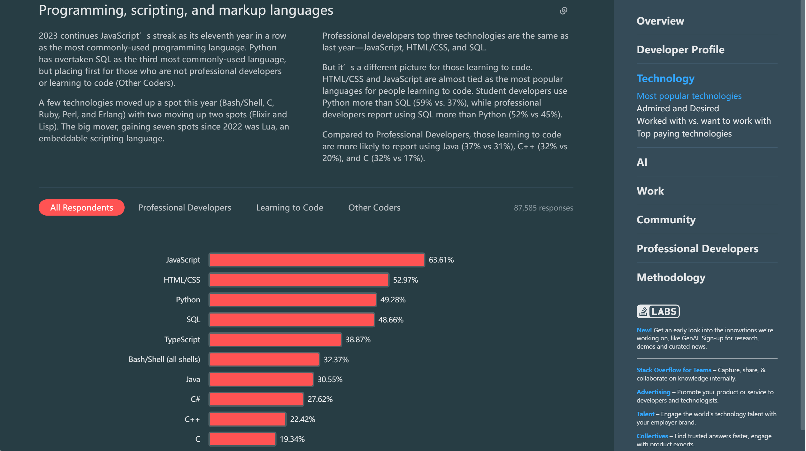

# 前端工程师生存指南 2024版

2023年年初AI大模型兴起，对每个攻城狮来说既是挑战也是机遇，AI大模型的爆发可预见地能够替代掉很多很基础的岗位，但同时它们能够极大地提高我们的工作效率，例如帮助我们写文档，生成一些代码模板，生成单元测试，解释源码。每个人不停地提升自身才能避免在时代的浪潮中沉没。

2023前端依然是最流行的编程技术。


2023年也是一个前端技术迸发的年份，有很多振奋人心的新技术出现或者趋于成熟:

- [bun正式版](https://bun.sh/)发布，支持linux，mac，win可以基于WSL体验。bun是一个JS的runtime，是一个打包工具， 是一个包管理工具， 是一个测试运行器，是一个all-in-one的工具包。这几乎本着大一统的方向去看的，基本上也对应了未来前端的趋势。
- node.js 20版本发布，初步支持了输出单个可执行应用程序，部署运维上跨出了关键性的一步。
- TC39中[Temporal](https://tc39.es/proposal-temporal/docs/index.html)已经进入stage3阶段（预发布），浏览器中已经可以访问了.
- Rust已经成为前端工具包的新宠儿，以C语言的性能（不带GC）得到比带GC的语言更高的内存安全性是他最大的优势。同时rust优秀的编译器，友好的错误提示， 和TS相似的类型语法，支持交叉编译生成可执行文件。（为什么偏偏是Rust？有趣的，Rust由Mozilla开发的， 火狐浏览器也是Mozilla开发的，Mozilla也是web标准的制定者之一，MDN：Mozilla Developer Network也是他们的网站😏）国内最早使用rust的大公司有字节跳动（go也是你），linux的内核也开始慢慢转向rust开发。

```rust
// 示例：TS的好兄弟属于是
let n: u32 = 100

fn main() {
  println!("你好, 世界!")
}
```

- 华为正式宣布鸿蒙系统的原生应用开发计划，并且已经提供了[开发套件](https://developer.huawei.com/consumer/cn/arkts/)，没错HarmonyOS的开发语言就是TypeScript的强化版。
- [Astro](https://docs.astro.build/zh-cn/concepts/why-astro/)：元框架的流行。如果你需要构建博客这种**以内容驱动的网站**，它会非常适合。
- 前端构建工具vite的作者在2023开发大会上宣布vite将在构建和开发模式下分别抛弃rollup和esbuild并计划开发一个rolldown用来获得更好的性能和开发构建一致性。
- AI派生应用源源不断地冒出来，前端可以用OpenAI或者谷歌提供的SDK来开发基于他们的大模型的AI应用。

- 低代码趋于成熟。2023年的低代码不再像前几年炒的那么火热，不过在某些简单场景下还是会有更高的效率， 例如图表，报表，大屏展示，工作台配置等等。
- Vue发布了3.3.x版本，年内应该会正式发布3.4.x版本，拥有更好的TS支持，开发时的类型提示和类型安全得到了极大的提升

## 言论

- 那些宣传得很美好的事物都是炒作，你只能得到承诺的一小部分效果。
- 当你成为某个领域的专家，遇到的问题就会非常具体，很可能只有少数人遇到过。再想进一步前进，互联网也不是很有用，只能靠自己摸索、应用、实验和协作。这些都相当慢，这就是为什么专家再要提升自己，往往要花费数年时间。 —— [《像旅行者一样学习》](https://ratrey.substack.com/p/psychology-of-learning-learn-like)
- 程序员的任务不仅仅是解决今天的问题，还要确保你的代码不会成为明天的问题。—— [《好的代码就像写给接手者的一封情书》](https://addyosmani.com/blog/good-code-essay/)
- 一项研究表明，领导力最重要的因素并不是能力，那些发言最多的人往往会成为团队的领导者。这称为"喋喋不休假说"。—— 《领导者的喋喋不休假说》
- 不要在疲劳的时候写代码。敬业和专业精神，更多地体现在你的纪律性，而不是体现在投入的时间。(温某人注：导致疲劳的原因往往是各种杂七杂八的事情，杂七杂八的事情多往往就是因为纪律性不够而产生)

## 职级评定 Level


### 初级前端工程师 L1

仅能完成简单模块和项目的开发工作，难以胜任复杂模块的开发。通常是入行不久，有1年或不到1年的工作经验。

需要具备的能力:

1. 熟悉前端基础知识如HTML、JS、CSS 。
2. 能够与团队成员协作并完成简单的任务。
3. 能够理解和使用常见的前端框架和库， 实现简单的页面布局和交互效果。
4. 具备基本的调试和问题解决能力，遇到复杂的组件和模块，会找现有的轮子使用，会使用百度、google等检索工具搜索问题。

#### 子职级细分

- L1-C： 对应其中2种能力
- L1-B： 对应其中3种能力
- L1-A： 对应其中4种能力

### 中级前端工程师 L2

在必要的辅导或标准流程支持下，能独立负责一个子模块或者一个项目的具体任务，对及时性和准确性负责。通常至少有2~3年工作经验。

需要具备的能力:

1. 除了前端基础知识外，熟悉计算机、网络等专业基础知识。
2. 熟练掌握工作中使用的技术栈开发业务，能够掌握小程序，web端，h5的开发。（除了 MVVM 框架外，还能熟练使用构建工具例如webpack，vite，rollup等）
3. 能了解一个需求从开发-上线整个生命周期，并对各个环节负责。具备逻辑分析、问题分解、归纳总结等能力。（例如如何对项目进行重构， 如何平衡和取舍需求，如何实现更好的程序交互等）
4. 了解基本的数据结构和算法，写代码能较熟练地应用，从而进行性能优化和调试。
5. 具备良好的代码质量和工程实践，能够编写可维护和可扩展的代码。
6. 能够设计和实现高效的页面布局和交互效果，独立设计和开发复杂的前端组件或模块。

#### 子职级细分

- L2-C： 对应其中2种能力
- L2-B： 对应其中4种能力
- L2-A： 对应其中6种能力

### 高级前端工程师 L3

具有独挡一面的能力，能够高质量完成工作，能把握一个项目的整体实现，在推行过程中能提炼新的方法或方案，或对现有方案提出改进建议并被证明有效。通常至少有3~5年的工作经验。

需要具备的能力:

1. 具有独挡一面的能力，能高质量的完成模块级的工作，找出问题的最佳实践。
2. 熟练掌握工作中使用的技术栈，并能了解它们的工作原理和实现原理。
3. 能够在一个需求从开发-上线整个生命周期中找到痛点，并能使用技术的手段解决，提升效率。
4. 能在模块维度对问题或需求做出分析和拆解，并做出相对合理的实现方案。
5. 熟练掌握基础的数据结构和算法，代码符合规范，逻辑清晰。
6. 具备其他多个领域技能的知识，纵览全局。

#### 子职级细分

- L3-C： 对应其中2种能力
- L3-B： 对应其中4种能力
- L3-A： 对应其中6种能力

### 前端专家/前端架构师 L4

能够领导团队有效完成大型项目开发. 有广泛的技术视野和较强的沟通协作能力，涉及多种技术栈。另外技术选型能力必须强，能够从效率、质量、成本多个维度权衡得出可行方案。至少有5~10年的开发经验

具备以下能力:

1. 除了前端领域，还具备其他领域的技术，掌握至少一种后端编程语言，掌握数据库表的设计，掌握常用的运维操作。
2. 具备良好的沟通和协作能力，能够清晰地表达自己的想法和需求，能够在多个项目和多个项目成员中有效沟通，能够为不同岗位的成员提供建议或者解决方案，为团队成员提供有效的技术文档。
3. 为不同的项目选型，同时能够布道新兴技术，为团队落实和沉淀技术栈。
4. 能够利用管理软件有效管理事务。
5. 对设计模式有深刻的了解，能够熟练的造轮子，能够参与到各种开源项目中去。
6. 掌握更加高级的数据结构和算法，能够利用这些算法解决各种问题。
7. 具备前端安全的知识和实践，能够识别和防止常见的前端安全漏洞，保护用户数据和应用的安全性。
8. 具备一定的技术领导能力，能够指导和指导团队中的其他成员，落实最佳实践，以及对技术的决策见解。

## 前端内容体系

- CSS
  - 框架。 tailwind, unocss, animate
  - BEM
  - Houdini

- Canvas/SVG
  - leafer-ui
  - fabric.js
- WebGl
  - three.js
  - pixijs
- WebRTC
- 数据可视化
  - echarts
  - D3
  - zrender
- 前端框架
- Web Components
- 实用密码学
  - crypto-js
- 移动端开发
  - 小程序
  - h5
  - native
- 桌面端开发
- 地图
  - Leaflet
  - deck.gl
  - OpenLayers
- 流程图
  - Flowy
  - GoJS
  - flowchart.js
  - BPMN

## 前端内容体系扩展
- 数据库
  - sequelize
  - prisma
  - typeorm
- 自动化 & 机器人流程自动化 - RPA
  - puppeteer
  - wechaty

- 云函数开发

- E2E端到端测试
  - cypress

- 单元测试
  - vitest

- 办公
  - excel
    - sheetjs
    - luckysheet
    - xlsx-populate

  - word
    - officegen
    - Mammoth
    - docx
  - PDF
    - PDF.js

- 解压缩
  - jszip
  - pako
  - adm-zip

- 构建编译工具
  - vite
  - swc
  - esbuild
  - rollup
  - tspack
  - turbo repo

- 代理
  - http-proxy
  - http-proxy-middleware

- 限流
  - rate-limiter-flexible

- 序列化
  - protobuf

- RPC
  - grpc-js
  - thrift

- 爬虫
  - node-crawler
  - x-ray
  - headless-chrome-crawler
  - node-osmosis

- AST抽象语法树
  - babel-parser
  - acorn
  - antlr
  - esprima

  - JS-Interpreter
  - jsjs
  - sval

- 硬件
  - johnny-five
  - serialport
  - usb
  - i2c-bus
  - gps
  - node-bluetooth
  - spi-device

- 机器学习和神经网络
  - tfjs

- 自然语言处理
  - compromise
  - natural

- GPT
  - chatgpt
  - @waylaidwanderer/chatgpt-api
  - open-ai
  - gemini-pro

- OCR
  - paddle-ocr
  - easy-ocr

## 前路漫漫 大浪淘沙

前端工程师如何积极应对挑战?

1. 持续学习
2. 实践出真知
3. 寻求反馈
4. 拓宽技能边界
5. 积极拥抱变化

## 2024到了

潜龙在渊 龙战于野

龙吟虎啸 龙行虎步

龙争虎斗 龙腾虎跃！
