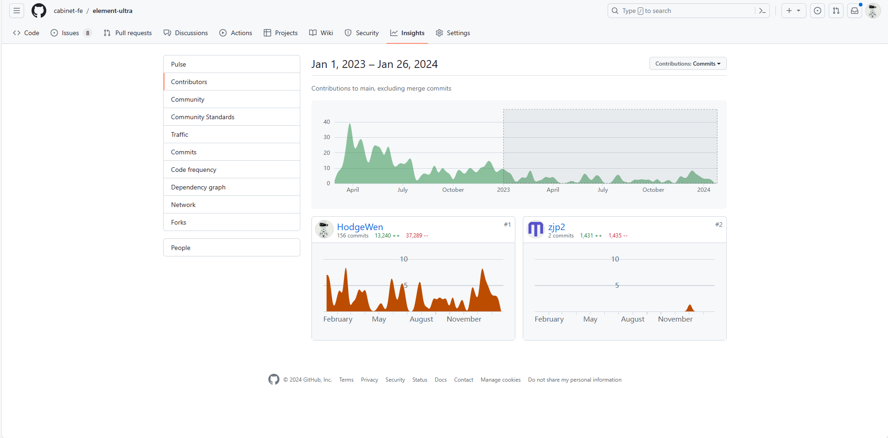
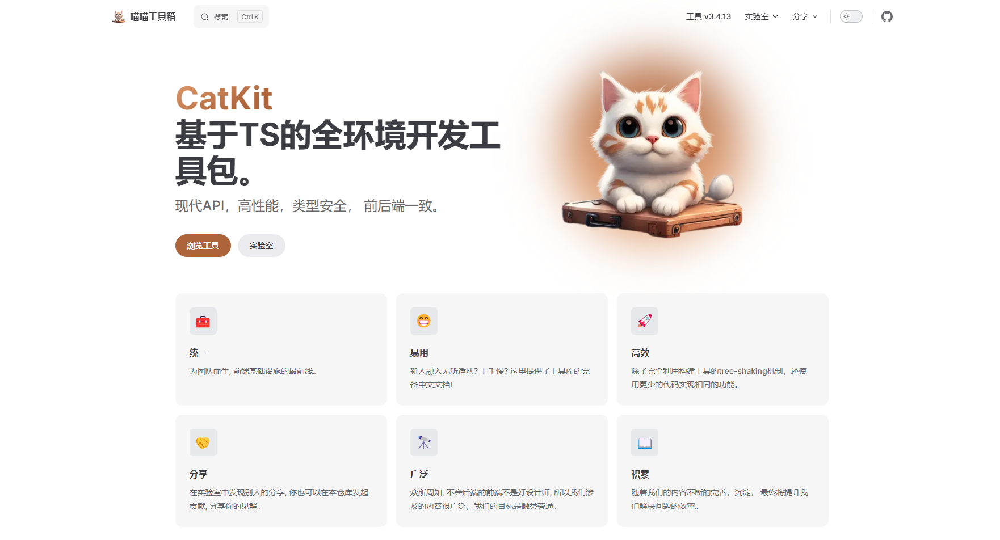
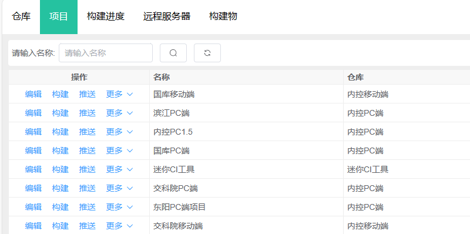
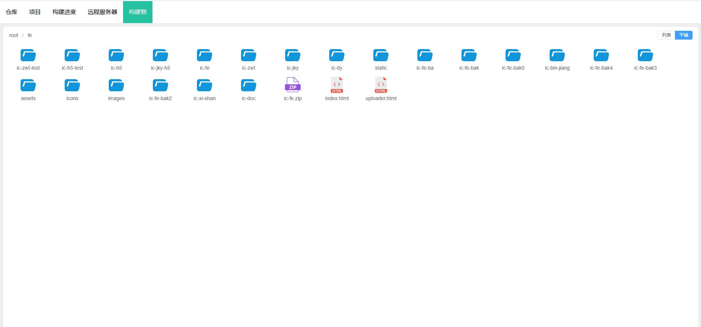
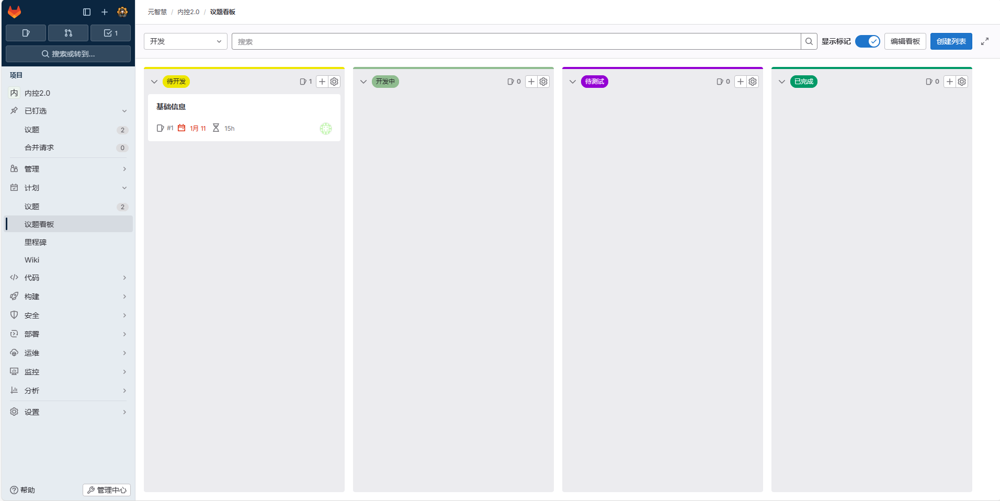
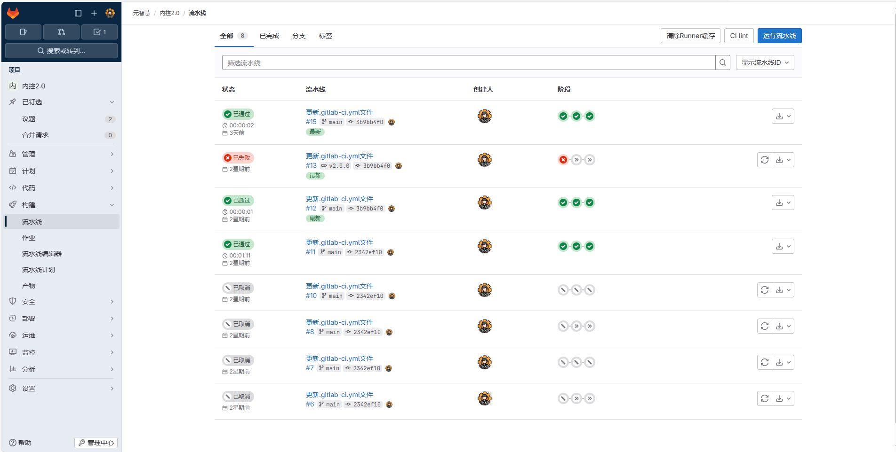
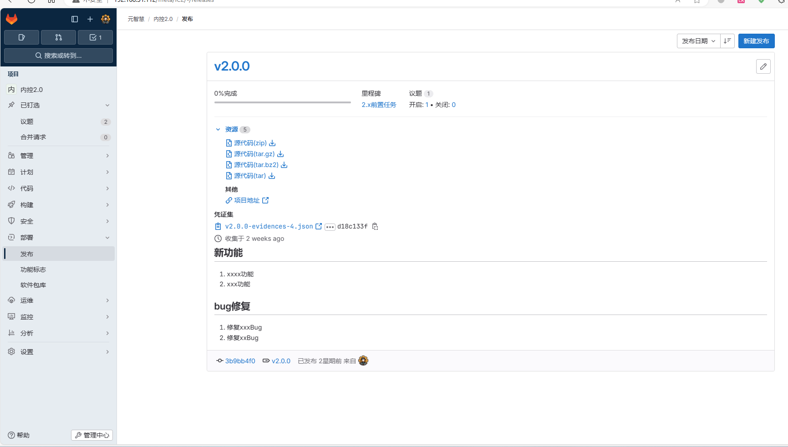
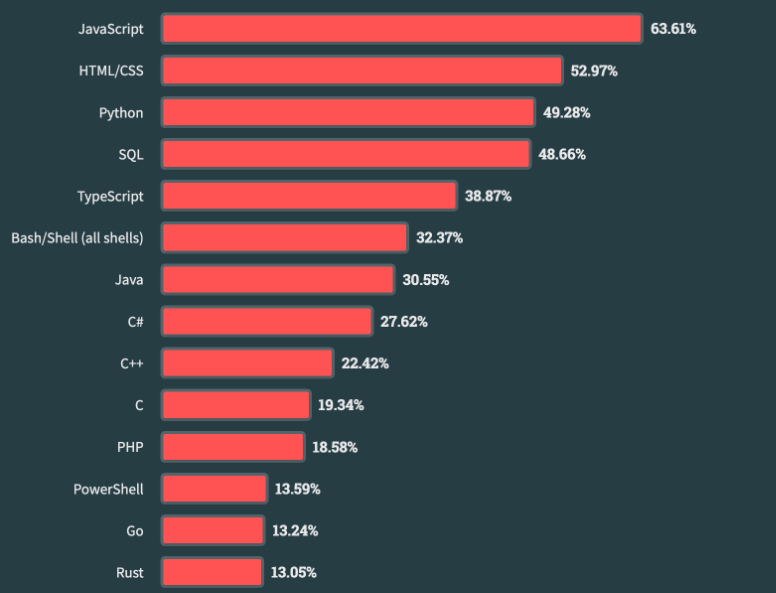
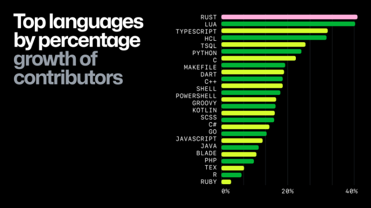
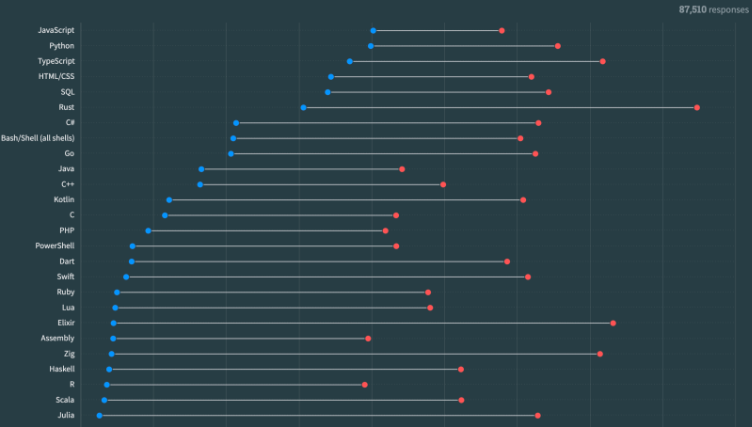

# 2023前端总结

## 里程碑

2023年已经过去了，元智慧前端团队完成了一些里程碑，下面是介绍：

### **技术栈迁移**

早期元智慧的前端项目使用vue2 + vue-cli + vuex + webpack + element-ui + typescript 的技术栈进行开发。随着项目的进行，这一套技术栈已不再满足我们的需求。因此自2022年开始，团队开始向新的技术栈演进， 抛弃了现有的所有代码，技术栈转为vue3 + vite + element-ultra + ts + pinia，到2023年底技术栈彻底落地。

### **低代码**

在过去两年里，低代码似乎是一个非常热门的话题，低代码的理想是用更少的代码完成项目的搭建和运行，经过两年的探索，我们已经摸索出一套在繁杂的配置与源码编译之间平衡的低代码方法论。

过去的2023年，低代码模块的可配置项越来越多，并且持续稳定的运行了一整年，在一定程度上减少了开发后期的维护工作。

然而随着需求的增加，我们的低代码配置越来越复杂，很多的术语更偏向于开发，包括软件的运行方式和原理也更加偏向于开发端， 这对软件实施人员和测试人员甚至开发热源造成了很严重的心智负担。是的，尽管是开发人员也需要完整地配置一遍才能够保证软件的基本运行。

实际上，纯粹的低代码严格意义上属于DSL的一种（领域特定语言），它实际上定义了一套有限规则，并且在这个规则下慢慢使软件成型，有限的规则意味着低代码不能实现全部的需求，除非我们将DSL推到和编程语言一样的高度，也就是最终实现一个图形化编程界面，但这种方式显然是不可能达到。

因此我们需要重新去解构什么叫做低代码：

- 低代码并不是用很少的代码完成一个软件，而是**写更少**的代码来构建软件。
- 低代码并不是将编程转化为图形化编程。
- 低代码的出现是为了方便后期的软件维护。
- 低代码不能限制我们的软件形态。

针对以上的解构，我们得到一套低代码的方法论：

- 代码层面，加强封装，增加代码复用，减少额外代码。
- 使用工具生成部分代码，比如根据代码目录结构生成路由，自动生成各个子模块的导出文件等等。
- 遵循约定优先的原则，尽可能地减少配置和数据结构转换，比如常用的命名，接口模式，字段文本冗余存储等等。
- 将非逻辑的代码用低代码模块去替代，逻辑代码依然遵循原有的方式开发。
- 通过AI大模型辅助我们写代码，阅读代码。

演示(右键视频在新标签页打开可全屏观看):
<video autoplay="" playsinline="" muted="" class="lp-Hero-video lp-Hero-video--landscape hide-reduced-motion" width="1248" height="735" poster="https://github.githubassets.com/assets/hero-poster-18f705106687.webp"><source src="https://github.githubassets.com/assets/hero-lg-6a98e47708e8.mp4" type="video/mp4; codecs=avc1.4d002a"></video>

### 完全重构审批模型

重构的审批模型渲染速度是先前版本的50 ~ 100倍。

拥有更加好看易用的UI。

支持审批要素，分单位设置不同的审批模型等功能。

### 魔改组件库

2023年我们魔改的组件库累计提交超过150次， 新增了多项功能。

### 喵喵工具箱

2023喵喵工具箱全新升级，以及更加美观，更加易读，更加丰富的文档。

[跳转体验](https://cabinet-fe.github.io/cat-kit/)

### 前端构建工具

为了让部署变得更加容易，我们实现一套轻量的持续集成工具，仅需简单的点击便可构建和部署前端包。

构建面板：

镜像目录下载面板：

### DevOps探索

DevOps是一种软件开发实践，旨在加强开发团队与运维团队之间的合作与沟通，以便更快、更可靠地交付软件。

我们在内网部署了一套DevOps实践软件，用于软件开发过程。

看板：

构建：

发版：

### 培训和学习会议

2023年度总共发起了10次以上的培训和学习会议，会议内容包括代码评审，技术技能培训，前沿技术分享，问答等。

## 技术总结和分享

### 语言与标准

根据 StackOverflow 2023 年度流行语言报告中统计显示， 前端三剑客（HTML/CSS/JavaScript）依然位居榜首。而 JavaScript 已连续 11 年成为最流行的编程语言，而 TypeScript 也上升到第五的位置。整体而言，前端社区依旧充满朝气与活力。

TypeScript5.0对包体积及构建速度进行全面优化

2023年3月16日 TypeScript 5.0 正式发布，该版本更新了许多令人激动的新特性，例如支持全新的装饰器、extends 支持多配置文件、引入 const 类型参数等。笔者认为 TypeScript 5.0 最大提升应该是在一直令人诟病的包体积大小和编译构建速度上的优化。

首先，TypeScript 从命名空间转移到了模块中，这使我们能够利用现代构建工具来执行优化，如作用域提升，此外还删除了一些废弃的代码。优化后，TypeScript 5.0 相较于 TypeScript 4.9 ，包体积从约 63.8 MB 减少到约 37.4 MB，降低了约 42%。

其次，TypeScript 5.0 还对代码的数据结构以及算法实现上进行优化，例如 TypeScript 5.0 会现有对一些常用的机制进行了缓存，以便在编译操作之间重复使用。TypeScript 5.0 相较于 TypeScript 4.9 编译速度上有着明显的提升。

ECMAScript 2023：持续完善并拓展 JavaScript 语法。

回顾完前端语言明日之星 TypeScript，让我们将目光转到 JavaScript 上。2023年 6 月 27 日，第 125 届 ECMA 大会正式批准了 ECMAScript 2023 语言规范。总而言之，本次 ECMAScript 2023 并没有新增大的改动点，更多是对 JavaScript 原来语法的完善与增补。而笔者认为其中比较有意义的更新主要有以下两个：

1. WeakMap 支持 Symbol 作为 Key。

总所周知， WeakMap 的 Key 是弱引用，且要求是唯一的值。由 Symbol 具有唯一性，保证不可重建，因此在去年的 ECMAScript 2023 新特性中扩展了 WeakMap API，WeakMaps 允许使用唯一的 Symbol 作为键。不过值得注意的是，通过 Symbol.for 创建的 Symbol 是不可以作为弱引用的，因为 Symbol.for 会在全局注册 Symbol，并支持在任何地方通过 Symbol.for 再次引用。

2. 新增四个通过副本修改数组的方法：toReversed()、toSorted()、toSpliced()、with()，

目前大多数的数组方法都是非破坏性的，当然也存在一些对原数组具有破坏性的方法，例如 reverse()、sort() 以及 splice() 。当我们想要使用这些方法又不想对原数组造成影响的话，通常需要先拷贝一份数组再调用相应的方法，由此可见，这种开发体验不友好的。因此在去年的 ECMAScript 2023 优化了开发体验，新增了相应的非破坏性方法。

除了 JavaScript 以外，CSS 也同样迎来了一系列新特性，这些特性不仅增强了样式和布局的能力，还提升了开发者的效率和用户体验。

CSS 2023 新特性中，原生 CSS 正式支持嵌套写法，在高版本浏览器中，无需依赖额外的编译器即可享受 Sass 嵌套语法，很大程度上优化了开发者体验，提高了CSS 的可读性和可维护性。众望所归的父选择器 :has 也正式被各大浏览器所支持, 现在你可以根据子元素来选择父元素了。

### 框架

在VueConf2023中发布了Vue的一些新特性：

1. VaporMode。 VaporMode 是 Vue3 受 Solid.js 启发新的编译模式。它不依赖于虚拟 DOM，而是更多地利用 Vue 的内置响应性系统。简而言之通过将代码编译为更高效的 JavaScript，减少运行时开销，以获取更好的页面性能。Vue 之所以支持实现与 Solid 类似的编译策略，是因为 Vue 与 Solid.js 具有类似的响应式系统，它们都通过使用代理的方式实现响应式，并具有基于读取的自动跟踪。目前仍在开发中。

2. 3.4.x版本。vue3.4版本正式发布，解析速度提高 2 倍，SFC 构建性能提高。更高效的响应式系统，defineModel宏转为稳定版本。

Vue2.x版本已经宣布停止维护，使用更新的框架是大势所趋。

### 前端工具Rust化

从 Github 2023 年度报告显示，Rust 增长率位于所有语言榜首，其年增长率到达 40%，并连续第八年被 2023 年 Stack Overflow 开发者调查评为最受赞赏的语言。

从 StackOverFlow 2023 年度开发者报告也显示，超过 80% 的开发人员希望在明年继续使用它。

由此可见，在 2023 年之间 Rust 受到了广大开发者的青睐，虽然整体使用率相较于其他语言较低，但是其增长势头非常迅猛，值得我们持续关注。

回顾2023年前端基建相关的开源工具来看，这个预言仿佛在一步步接近现实，在前端基础建设领域不断出现 Rust 的身影。

2022年10月底，Next.js 发布了基于 Rust 的构建工具 Turbopack，因为性能数据非常惊艳，引起了一时的轰动。

2023 年 3 月 10 日，字节跳动发布了基于 Rust 的构建工具 Rspack 正式发布，经官方开发者验证可以给项目带来 5 ～ 10 倍的编译效率提升。

2023 年 10 月 5 日的 ViteConf 2023 线上大会中，Vue 作者尤雨溪也宣布计划使用 Rust 重构 Vite，替换掉原有的 Esbuild 和 Rollup，以获得更好的性能。

2023 年 12 月 12 日，基于 Rust 的代码检查工具 Oxlint 正式发布，Shopify 报告称其比 ESLint 快 50 - 100 倍，并可以随 CPU 核心数量不断扩展。

Rust 因为其出色的性能，在编译、打包构建等前端基建的方向所带来的性能数据提升令人震撼。在 JavaScript 性能提升挖掘缓慢的今天，不少前端基础建设框架/库的开发者为追求更高的性能开始逐渐将目光转向了 Rust。由此可以预测，Rust 工具将会更加深度地融入前端生态，说不定会掀起新一轮的前端基础建设浪潮，让我们拭目以待。

### JS家族派生

node.js 20版本发布，初步支持了输出单个可执行应用程序，部署运维上跨出了关键性的一步。

除了已知的node外，bun在2023年发布了1.0正式版，拥有更好的性能和All in one的体验，是去年的一匹绝对的黑马，并且本周即将发布windows版本。

### WebAssembly

随着互联网的发展，越来越多的应用程序借助 JavaScript 迁移到了 Web 上，但人们也注意到下载、解析、编译 JavaScript 会消耗大量时间，导致页面加载时间过长，最终导致用户流失。

为了解决这些问题，Mozilla 的工程师 Alon Zakai 在 2012 年提出了 Asm.js，经过几年的发展，终于在 2015 年进化为 WebAssembly。

WebAssembly（缩写为 Wasm）是一种用于基于堆栈的虚拟机的二进制指令格式。 Wasm 被设计为编程语言的可移植编译目标，支持在 Web 上部署客户端和服务器应用程序。

到 2024 年，Wasm 走过了12个年头，Wasm 已经在广泛的环境中使用，从浏览器到边缘和 IoT，甚至到云端。

随着人工智能和大模型的兴起，在硬件越来越好的将来，在浏览器部署基于WebAssembly的本地大模型指日可待。

### 鸿蒙next

华为正式宣布鸿蒙系统的原生应用开发计划，并且已经提供了开发套件，没错HarmonyOS的开发语言就是TypeScript的强化版: [ArkTS](https://developer.harmonyos.com/cn/develop/arkts/)。依据前端的庞大生态来看，鸿蒙next真的很有可能成功。

### 拥抱AI
过去一年以来，AI给工作上带来的帮助非常明显，包括此前的喵喵工具箱的logo实际上就是用大模型的文生图生成的。初次之外ai能够帮助我们理解和阅读代码，也能够帮助我们生成简单代码，极大的增加了开发效率。我想，不仅仅是对前端工程师，AI可以给所有人带来帮助，不管是工作，学习还是生活。