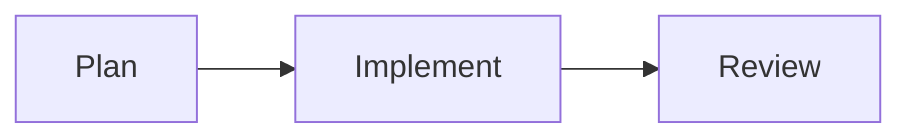

# @cat-kit/vitepress-theme — Demo 与 Mermaid

先按 [index.md](index.md) 同时安装主题入口和 `defineThemeConfig`。

假设配置中的 `examplesDir` 指向 `docs/examples`，页面可按相对路径渲染 Vue 示例：

```markdown
::: demo forms/LoginForm.vue
:::
```

同一页面可直接使用 Mermaid 围栏：

````markdown

````

若站点只需要 Mermaid 转换而不需要 Demo 导入插件，可从公开 `config` 子路径选择低层能力：

```ts
import { mermaidPlugin } from '@cat-kit/vitepress-theme/config'
import { defineConfig } from 'vitepress'

export default defineConfig({
  markdown: {
    config(md) {
      md.use(mermaidPlugin)
    }
  }
})
```

此时仍需使用 `@cat-kit/vitepress-theme` 的默认主题入口，因为它负责注册渲染用的 `Mermaid` 组件。
